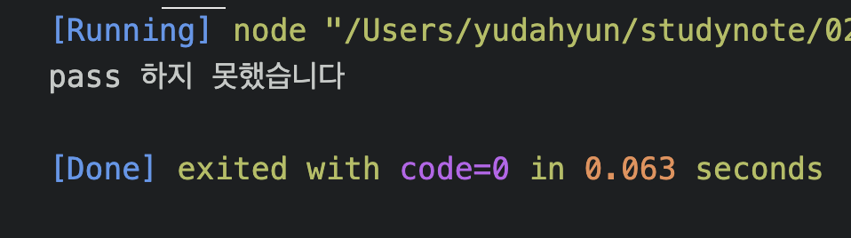

# 유다현 연산자 과제

> 2022-01-26

### 문제1

---

```javascript
const A = true;
const B = true;
const C = true;
const D = false;

const myMath = D;

if (myMath == true) {
  console.log("pass 입니다");
} else if (myMath == false) {
  console.log("pass 하지 못했습니다");
}
```



### 정답

```javascript

    const 수학 = "A";

    if(수학 = "A" || 수학 = "B" || 수학 = "C" ){
        console.log("pass 입니다.");
    }else{
        console.log("pass 아닙니다.");
    }

```

### 문제2

---

```javascript
let x = 1;

while (x <= 13) {
  const z = x * 13;
  console.log("13 x %d = %d", x, z);
  x++;
}
```


### 문제3

---

```
let x = 1;
let i = 1;

while(i <= 10){
    x *= 2;
    console.log("이진수 %d개는 %d개의 정보를 표시가능",i,x);
    i++;

};
```

### 문제4

```

let x = 1;
let i = 1;

for(let i = 1; i <= 10;i++){
    x *= 2;
    console.log("이진수 %d개는 %d개의 정보를 표시가능",i,x);

}
```


