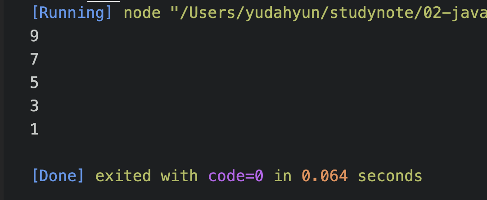
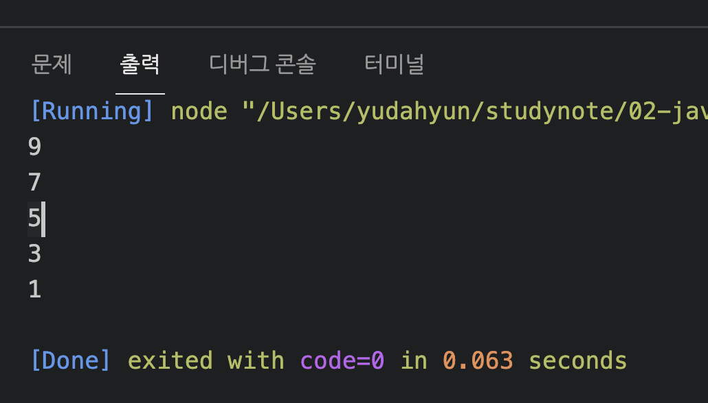
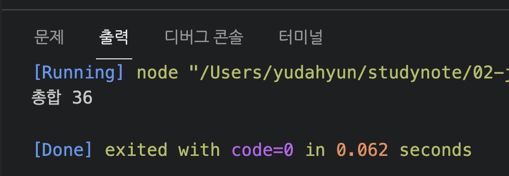
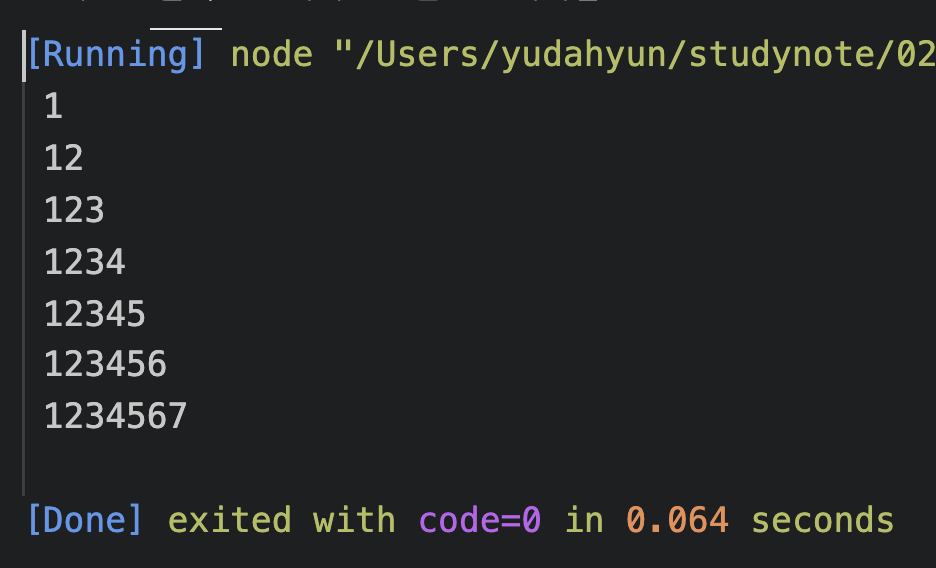

# 유다현 연산자 과제

> 2022-01-27

### 문제1

---

```javascript
for (let i = 10; i > 0; i--) {
  if (i % 2 == 1) {
    console.log(i);
  }
}
```



### 문제2

```javascript
let i = 10;
while (i > 0) {
  i--;
  if (i % 2 == 1) {
    console.log(i);
  }
}
```


### 문제3

```javascript

let all = 0;
for(let i = 1; i < 20 ;i ++){

    if(i % 2 == 0 && i % 3 == 0){
        
       // console.log("배수인 수는 %d",i);
        all += i;
        
        
    }
    // else{
    //     console.log("배수 아닌 수는 %d",i)
    // }
    
}
console.log("총합",all);
```




### 문제6
```javascript

let str = " " ;
for(let i = 1 ; i < 8 ; i ++){
    for(let j = 1 ; j < 8 ; j ++){
        str += j;
        console.log(str);
        
      }
      break;

}

```



