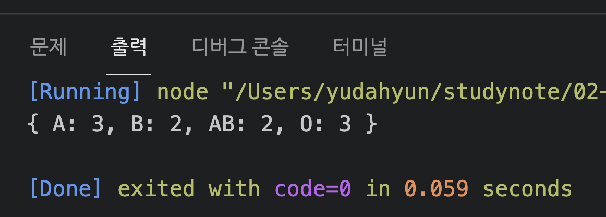
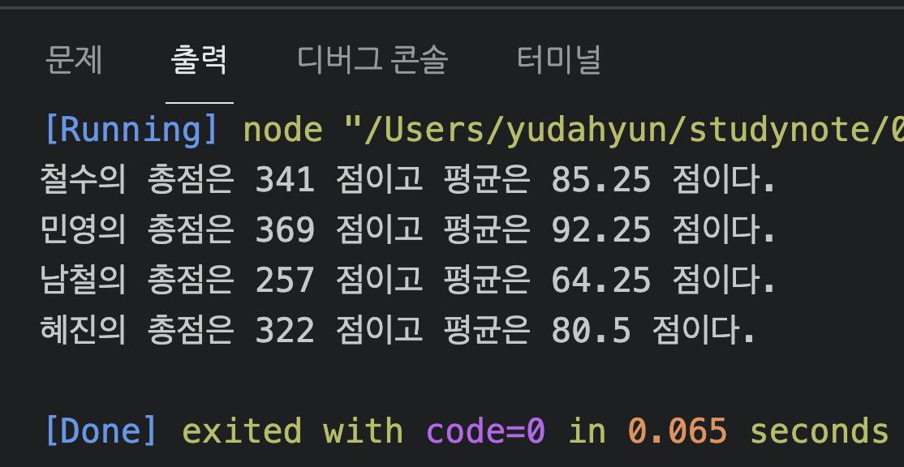
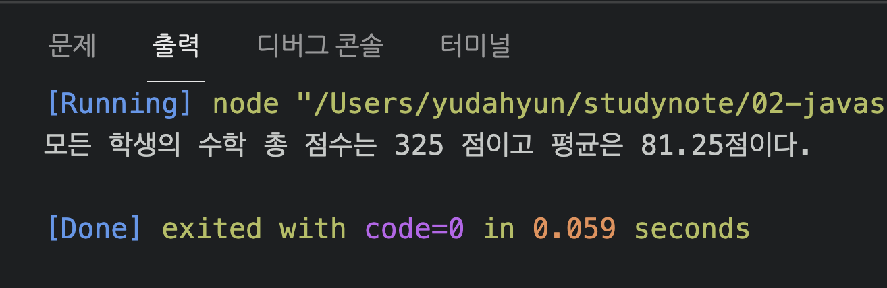
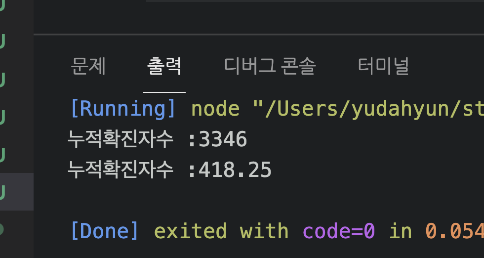
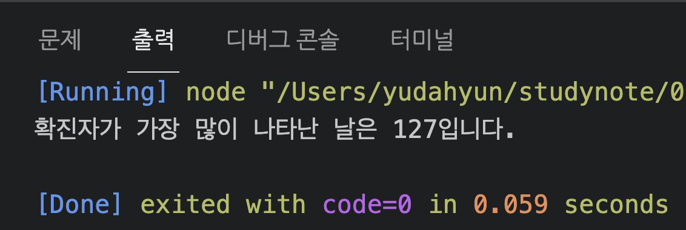
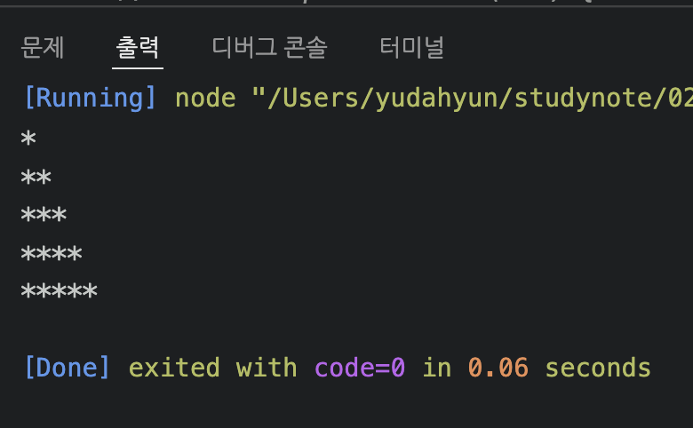
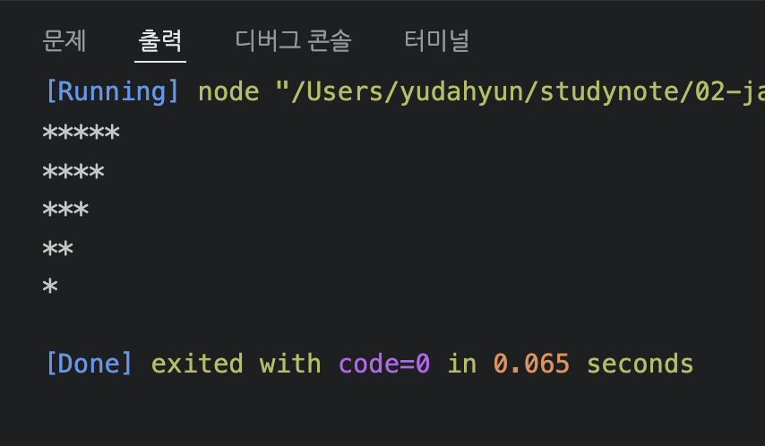
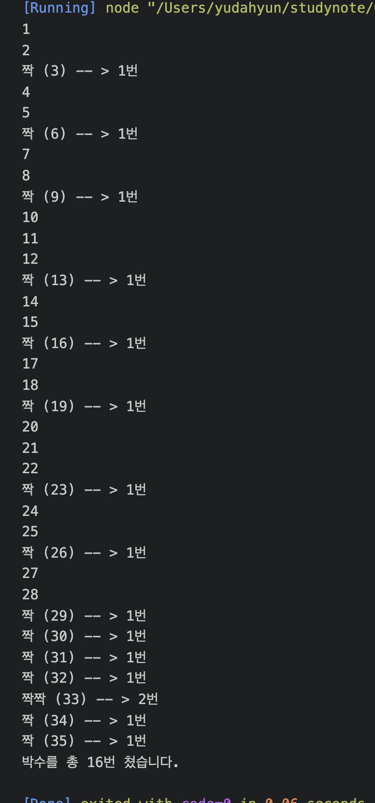

# 유다현 연산자 과제
> 2022-02-07
### 문제1
---
```javascript

for (const b of bType) {
  result[b]++;
}
console.log(result);

```




### 문제2
```javascript

    for(const key in exam){
    //    console.log(exam[key]);
        let sum = 0;
        for(const p of exam[key]){
            sum += p;
        }
        let avg = sum /exam[key].length;
        console.log("%s의 총점은 %d 점이고 평균은 %d 점이다.",key,sum,avg)
    }
```



### 문제 2-2
```javascript
let sum = 0;
let student_count = 0;
for (const key in exam){
    sum += exam[key][2];

    student_count++;
} 
let avg = sum /student_count;

console.log("모든 학생의 수학 총 점수는 %d 점이고 평균은 %d점이다.",sum,avg);
```




### 문제 3
```javascript
 let sum = 0;
 for (const j of covid19){
     sum +=j.active;
 }
 console.log("누적확진자수 :%d",sum);
 console.log("누적확진자수 :%d",sum/covid19.length);
```



### 문제 4
```javascript
let max_active = covid[0].active;
let max_date = covid[0].date;

for ( const j of covid19){
    if(max_active < j.active){
        max_active = j.active;
        max_date = j.date;
    }

}
console.log("확진자가 가장 많이 나타난 날은 %d입니다.",max_date");
```



### 함수 문제 1 
```javascript
function printStar(max) {
    //... 구현하세요 ...
    for(let i = 0 ; i < max; i ++){
        let star  = "";
        for(let j = 0; j < i+1 ; j++){
            
           star += "*";
        }
        console.log(star);                 
           
     } 
}

printStar(5);

```

### 함수 문제 2
```javascript
function printRevStar(max) {
    //... 구현하세요 ...
    for(let i = 0 ; i < max; i ++){
        let star  = "";
            
        for(let j = 0; j < max-i ; j++){
            
           star += "*";
        }
        console.log(star);                 
           
     } 
}

printRevStar(5);

```

### 함수 문제 2
```javascript
function myGame(n){
   //총박수 몇번 쳤는지
    let count = 0;

    for(let i = 1; i <=n;i++){
        
            //console.log(i);
            //현재숫자 i를 문자열로 변환함.
            const str = i + "";
            //빈 문자열을 더한거임


            //출력할 문자열
            let say = "";
            let clap = 0;

            //각 글자 수만큼 반복
            for(let j of str){
               // console.log(j);
                if(j == "3" || j == "6" || j== "9"){
                    say += "짝";
                    clap ++;
                }
            
            }
            if(clap == 0){
                    console.log(i);
            }else{
                    console.log("%s (%d) -- > %d번",say,i,clap);
                    count += clap;
            }
        
          
           
    }
    console.log("박수를 총 %d번 쳤습니다.",count);
}
myGame(35);


```



