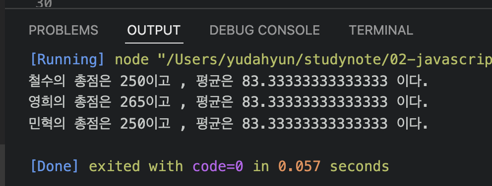
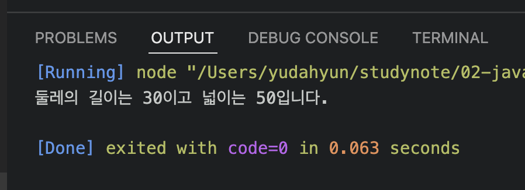
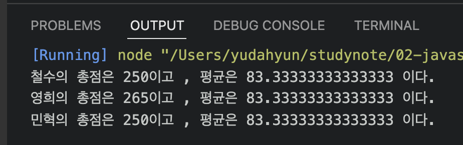
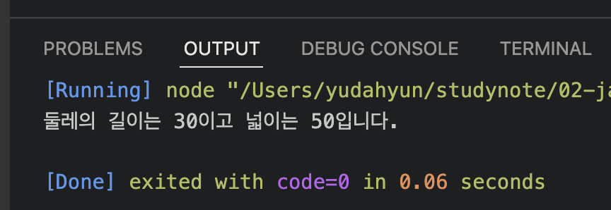

# 유다현 연산자 과제
> 2022-02-09
### 문제1
---
```javascript
function Student(kor,eng,math){
    this._kor = kor;
    this._eng = eng;
    this._math = math;
};

Student.prototype ={
    sum : function(){
        return this._kor+ this._eng + this._math;
    }, 
    avg : function (){

        return this.sum() / 3;
    }
  };

  const grade =[
      ["철수",92,81,76],
      ["영희",72,95,84],
      ["민혁",80,86,98]
  ];

  const s1 =new Student(92,81,77);
  const s2 =new Student(72,95,98);
  const s3 =new Student(80,86,84);
  
  console.log("철수의 총점은 %d이고 , 평균은 %d 이다.",s1.sum(),s1.avg());
  console.log("영희의 총점은 %d이고 , 평균은 %d 이다.",s2.sum(),s1.avg());
  console.log("민혁의 총점은 %d이고 , 평균은 %d 이다.",s3.sum(),s1.avg());


```



```javascript

function Rectangle(){
    this._width = null;
    this._height = null;
}

Rectangle.prototype = {
    get width(){
        return this._width;
    },
    set width(param) {
         this._width = param;
    },
    get height (){
        return this._height;
    },
    set height(param){
         this._height = param;
    },
    getAround : function(){
        return this.width * 2 + this.height * 2;
    },
    getArea : function (){
        return this.width * this.height;
    },
};

const rect = new Rectangle ();
rect.width = 10;
rect.height = 5;

console.log('둘레의 길이는 %d이고 넓이는 %d입니다.',rect.getAround(),rect.getArea());
```


### 문제 3
```javascript
class Student{
    constructor(kor,eng,math){
        this._kor = kor;
        this._eng = eng;
        this._math = math;
    }
    sum (){
        return this._kor+ this._eng + this._math
    }
    avg(){
        return this.sum() / 3;
    }
};

  const grade =[
      ["철수",92,81,76],
      ["영희",72,95,84],
      ["민혁",80,86,98]
  ];

  const s1 =new Student(92,81,77);
  const s2 =new Student(72,95,98);
  const s3 =new Student(80,86,84);
  
  console.log("철수의 총점은 %d이고 , 평균은 %d 이다.",s1.sum(),s1.avg());
  console.log("영희의 총점은 %d이고 , 평균은 %d 이다.",s2.sum(),s1.avg());
  console.log("민혁의 총점은 %d이고 , 평균은 %d 이다.",s3.sum(),s1.avg());

```
;

### 문제4
```javascript
class Rectangle{

    constructor(){
        this._width = null;
        this._height = null;
            
    }
    get width(){
        return this._width;
    }
    set width(param) {
         this._width = param;
    }
    get height (){
        return this._height;
    }
    set height(param){
         this._height = param;
    }
    getAround(){
        return this.width * 2 + this.height * 2;
    }
    getArea(){
        return this.width * this.height;
    }
};

const rect = new Rectangle ();
rect.width = 10;
rect.height = 5;

console.log('둘레의 길이는 %d이고 넓이는 %d입니다.',rect.getAround(),rect.getArea());
```

;