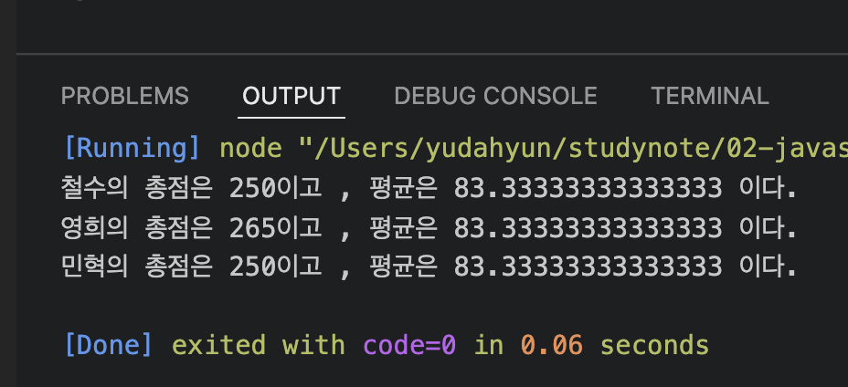
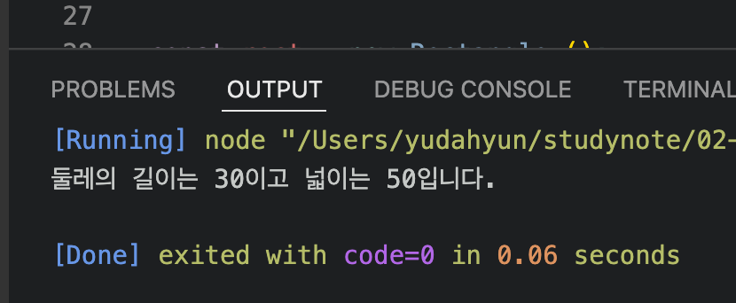
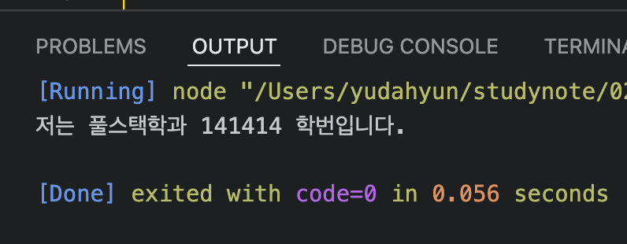
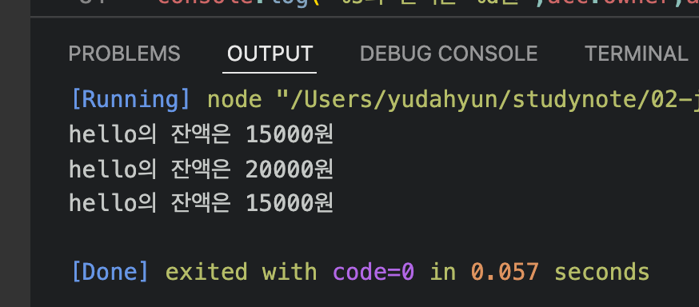

# 유다현 연산자 과제
> 2022-02-10

### 이전 연습 문제 --> class 기반으로 변경
```javascript


class Student{
    constructor(kor,eng,math){
        this._kor = kor;
        this._eng = eng;
        this._math = math;
    }
    sum(){
        return this._kor+ this._eng + this._math;
    }
    avg(){
        return this.sum() / 3;
    }
}


  const grade =[
      ["철수",92,81,76],
      ["영희",72,95,84],
      ["민혁",80,86,98]
  ];

  const s1 =new Student(92,81,77);
  const s2 =new Student(72,95,98);
  const s3 =new Student(80,86,84);
  
  console.log("철수의 총점은 %d이고 , 평균은 %d 이다.",s1.sum(),s1.avg());
  console.log("영희의 총점은 %d이고 , 평균은 %d 이다.",s2.sum(),s1.avg());
  console.log("민혁의 총점은 %d이고 , 평균은 %d 이다.",s3.sum(),s1.avg());

```


;

### 이전 연습 문제 --> class 기반으로 변경
```javascript

class Rectangle{
    constructor(width,height){
        this._width = width;
        this._height = height;
    }
    get width(){
        return this._width;
    }
    set width(param){
        this._width = param;
    }
    get height (){
        return this._height;
    }
    set height(param){
         this._height = param;
    }
    getAround (){
        return this.width * 2 + this.height * 2;
    }
    getArea (){
        return this.width * this.height;
    }
}


const rect = new Rectangle ();
rect.width = 10;
rect.height = 5;

console.log('둘레의 길이는 %d이고 넓이는 %d입니다.',rect.getAround(),rect.getArea());
```

### 문제1
---
```javascript

class Student {
    constructor(ban, num){
        this._ban = ban;
        this._num = num;

    }

    get ban(){
        return this._ban;
    }
    set ban(param){
        this._ban = this.ban;
    }
    get num(){
        return this._num;
    }
    set num(param){
        this._num = this.num;
    }
    
    sayHello(){
       
        console.log("저는 %s학과 %d 학번입니다.",this.ban,this.num);
    }
};
const s1 = new Student("풀스택",141414);
s1.sayHello();

```



### 문제2
``` javascript

class Account {
    constructor (owner,balance ){
        this._owner = owner;
        this._balance = balance;
    }
    get owner(){
        return this._owner;

    }
    set owner(value){
        this._owner =value ;
    }
    get balance(){
        return this._balance ;
    }
    set balance(value){
        this._balance = value;
    }
    deposit(amount){
        this.balance += amount;
       
    }
    withdraw(amount){
        if(this.balance < amount){
            console.log("잔액이 부족합니다.");
            return 0;
        }
        this.balance -= amount;
        return amount ;    
    }

};

const acc = new Account("hello",15000);
console.log("%s의 잔액은 %d원",acc.owner,acc.balance);

//저축
acc.deposit(5000);
console.log("%s의 잔액은 %d원",acc.owner,acc.balance);

//인출
acc.withdraw(5000);
console.log("%s의 잔액은 %d원",acc.owner,acc.balance);

```
;