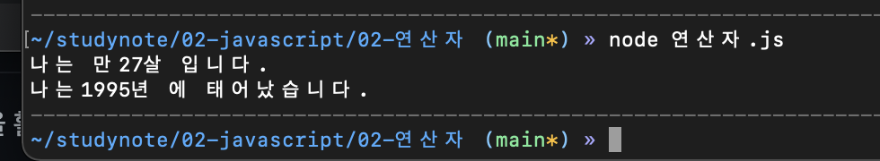

# 유다현 연산자 과제
> 2022-01-25
### 문제1
---
```javascript
const year = 2022;
let age = 1995;

console.log("나는 만"+(year-age)+"살 입니다.");


```

### 문제2

```javascript


const myAge = year - age;
let todayYear = 2022;


console.log("나는"+(todayYear - myAge)+"년 에 태어났습니다.");


```



### 문제3

```javascript 
 let numOfApples = 123;
 //현재 갖고 있는 사과의 수

 var basket =  numOfApples/10 ;
// 사과 바구니는 사과수 10으로 나눔

numOfApples %= 10;
//사과 10개로 나눈 나머지

numOfApples < 10 ? basket++ : basket;
//10보다 작으면 1 , 아니면 0


```
