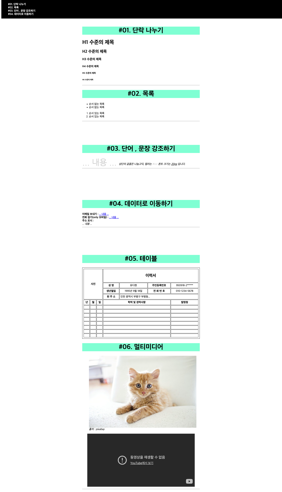

# 유다현 html 과제
> 2022-02-28

```css
      
      
        .wrappr {
            width: 700px;
            margin: 150px auto 0;

        }

        .top-title {
            font-weight: bold;
            font-size: 20px;
            background-color: aquamarine;


        }

        .top-title h1 {
            text-align: center;
        }

        .section {
            min-height: 300px;

        }

        .nav {
            position: fixed;
            top: 0;
            background: black;
            width: 100vw;
        }

        li a {
            color: #fff;
            font-weight: bold;
            list-style: none;
            text-decoration: none;
            display: block;
        }

        /* table style */
        table{
            width: 734px;
            margin: 0 auto;
            
        }
        table,
        th,
        td {
            border: 1px solid;
            padding: 5px;
        }

        .padding td ,
        .padding th
         {
            padding: 10px;
        }
```
```html

    <div class="nav">
        <ul>
            <li>
                <a href="#section1">#01. 단락 나누기</a>
                <a href="#section2">#02. 목록</a>
                <a href="#section3">#03. 단어 , 문장 강조하기</a>
                <a href="#section4">#04. 데이터로 이동하기</a>
            </li>
        </ul>
    </div>
      <div class="nav">
        <ul>
            <li>
                <a href="#section1">#01. 단락 나누기</a>
                <a href="#section2">#02. 목록</a>
                <a href="#section3">#03. 단어 , 문장 강조하기</a>
                <a href="#section4">#04. 데이터로 이동하기</a>
            </li>
        </ul>
    </div>
    <div class="wrappr">

        <div class="section">
            <div class="top-title" id="section1">
                <h1>
                    #01. 단락 나누기

                </h1>
            </div>
            <h1>H1 수준의 제목</h1>
            <h2>H2 수준의 제목</h2>
            <h3>H3 수준의 제목</h3>
            <h4>H4 수준의 제목</h4>
            <h5>H5 수준의 제목</h5>
            <h6>H6 수준의 제목</h6>
            <hr />
        </div>

        <div class="section">
            <div class="top-title" id="section2">
                <h1>
                    #02. 목록

                </h1>
            </div>
            <div>
                <ul>
                    <li>순서 없는 목록 </li>
                    <li>순서 없는 목록 </li>
                </ul>
                <ol>
                    <li>순서 있는 목록</li>
                    <li>순서 있는 목록</li>
                </ol>
            </div>
            <hr />
        </div>
        <div class="section">
            <div class="top-title" id="section3">
                <h1>
                    #03. 단어 , 문장 강조하기

                </h1>
            </div>
            <font face="나눔고딕" color="#ccc" size="20px"> ... 내용 ... </font>
            <i>
                상단의 글꼴은 나눔고딕, 컬러는 <span style="color: #ccc;">#ccc</span>
                폰트 크기는 <u>20px</u> 입니다.
            </i>
            <hr />
        </div>

        <div class="section">
            <div class="top-title" id="section4">
                <h1>
                    #04. 데이터로 이동하기

                </h1>

            </div>
            <div>
                <b>
                    이메일 보내기 :
                </b>
                <a href="mailto:이메일주소"> ... 내용 ... </a>
                <br>

                <b>
                    전화 걸기(only 모바일) :
                </b>
                <a href="tel:전화번호"> ... 내용 ... </a>
                <br>
                <b>
                    주소 표시 :
                </b>
                <address> ... 내용 ... </address>
            </div>
            <hr />
        </div>
        <div class="section">
            <div class="top-title" id="section4">
                <h1>
                    #05. 테이블

                </h1>

            </div>
            <table>
                <tr>
                    <th colspan="3" rowspan="4">사진</th>
                    <th colspan="4">
                        <h2 style="text-align:  text-center">
                            이력서
                        </h2>
        
                    </th>
                </tr>
                <tr>
                    <th>
                        <b>
                            성 명
                        </b>
        
                    </th>
                    <td align="center">
                        유다현
                    </td>
                    <th>
                        주민등록번호
                    </th>
                    <td  align="center">950918-2******</td>
        
                </tr>
                <tr>
                    <th>
                        생년월일
                    </th>
                    <td  align="center">
                        1995년 9월 18일
                    </td>
                    <th>
                        전 화 번 호
                    </th>
                    <td colspan="2"  align="center">
                        010-1234-5678
                    </td>
                </tr>
                <tr>
                    <th>
                        현 주 소
                    </th>
                    <td colspan="3">
                        인천 광역시 부평구 부평동...
                    </td>
                </tr>
                <tr>
                    <th>
                        년
                    </th>
                    <th>월</th>
                    <th>일</th>
                    <th colspan="3">학력 및 경력사항</th>
                    <th>발령청</th>
                </tr>
                <tr class="padding">
                    <td></td>
                    <td></td>
                    <td></td>
                    <td colspan="3">
                         
                    </td>
                    <td></td>
                </tr>
                <tr class="padding">
                    <td></td>
                    <td></td>
                    <td></td>
                    <td colspan="3">
                         
                    </td>
                    <td></td>
                </tr>
                <tr class="padding">
                    <td></td>
                    <td></td>
                    <td></td>
                    <td colspan="3">
                         
                    </td>
                    <td></td>
                </tr>
                <tr class="padding">
                    <td></td>
                    <td></td>
                    <td></td>
                    <td colspan="3">
                         
                    </td>
                    <td></td>
                </tr>
                <tr class="padding">
                    <td></td>
                    <td></td>
                    <td></td>
                    <td colspan="3">
                         
                    </td>
                    <td></td>
                </tr>
                <tr class="padding">
                    <td></td>
                    <td></td>
                    <td></td>
                    <td colspan="3">
                         
                    </td>
                    <td></td>
                </tr>
                <tr class="padding">
                    <td></td>
                    <td></td>
                    <td></td>
                    <td colspan="3">
                         
                    </td>
                    <td></td>
                </tr>
                <tr class="padding">
                    <td></td>
                    <td></td>
                    <td></td>
                    <td colspan="3">
                         
                    </td>
                    <td></td>
                </tr>
           
        
            </table>
           
        </div>
        <div class="section">
            <div class="top-title" id="section4">
                <h1>
                    #06. 멀티미디어

                </h1>
            </div>
            <figure>
                
              
                <figcaption>
                    <i>출저 : pixabay</i>
                </figcaption>
            </figure>
            <div style="display: block;text-align: center;margin: 0 auto;">
                <iframe width="640" height="315" style="margin: 0 auto;" src="https://www.youtube.com/embed/cbuZfY2S2UQ" title="YouTube video player" frameborder="0" allow="accelerometer; autoplay; clipboard-write; encrypted-media; gyroscope; picture-in-picture" allowfullscreen></iframe> 

            </div>
             <!-- 출저 : 유투브 -->
            <hr>

        </div>

    </div>
```


