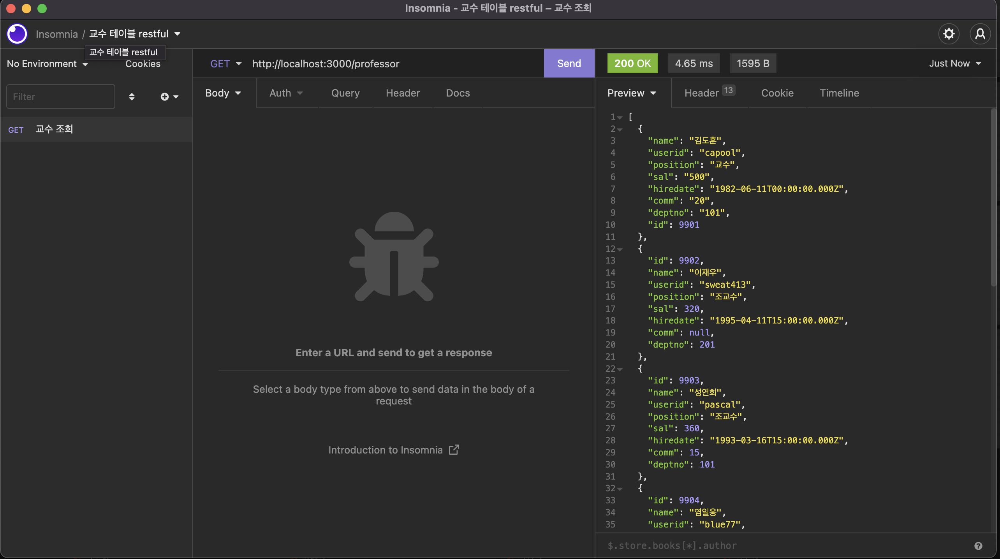
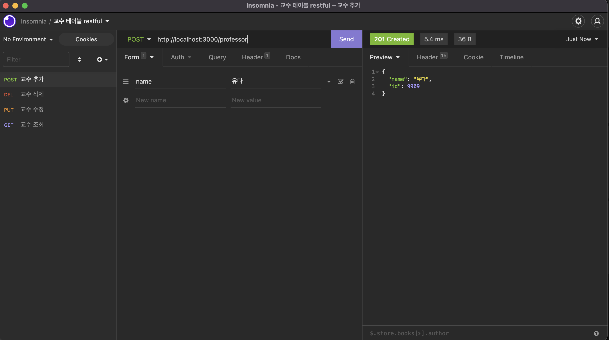
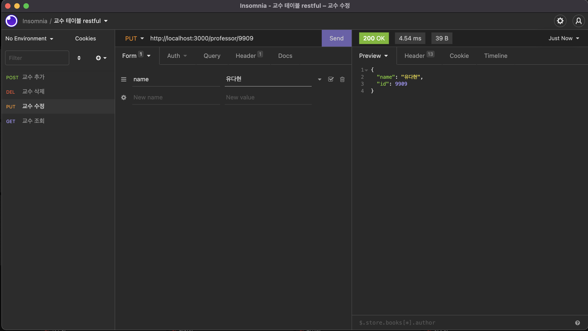
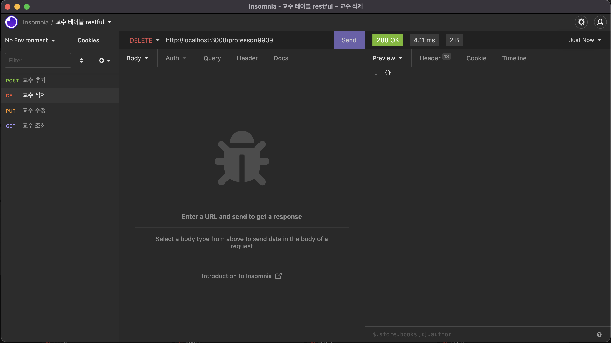
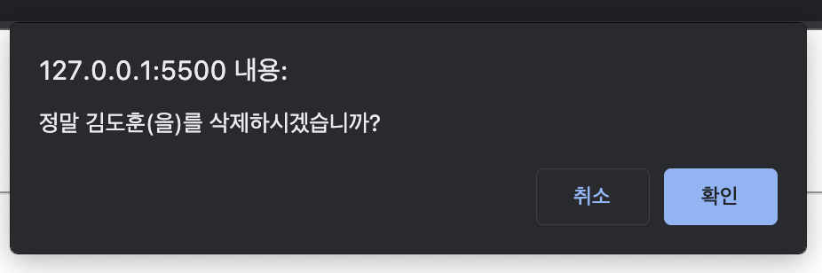
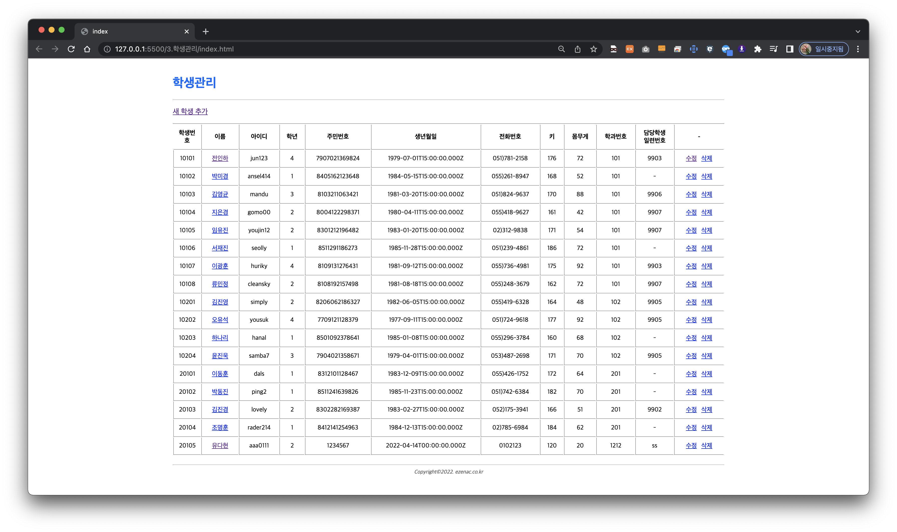
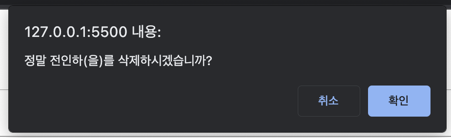
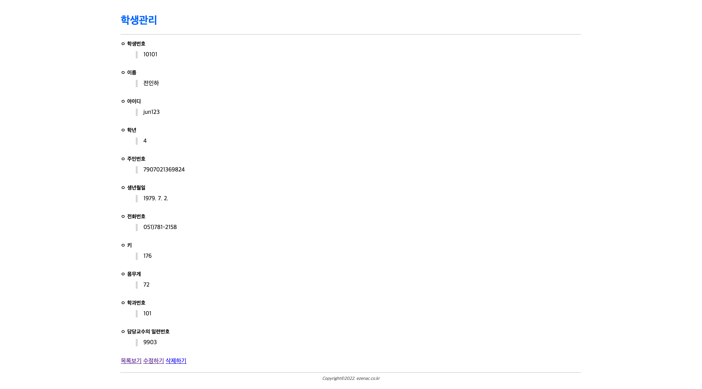
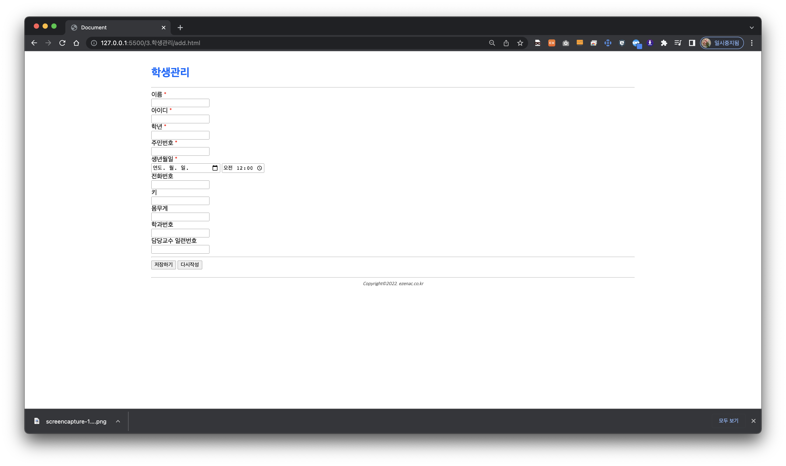
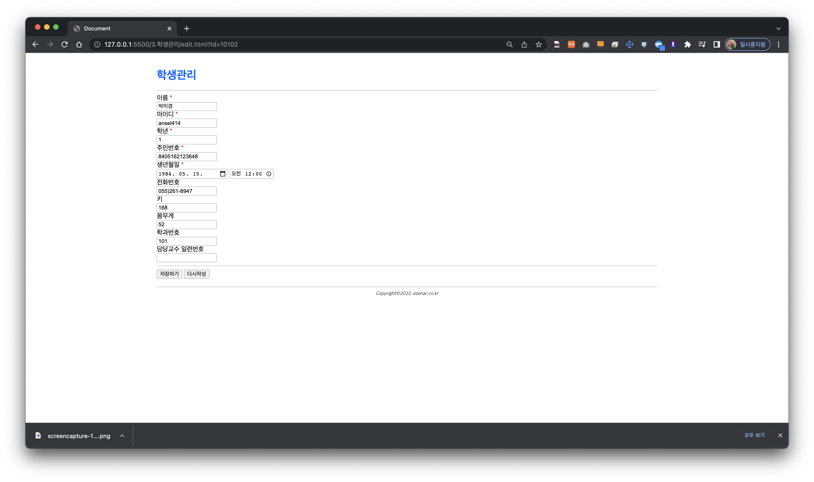

### 04-07 유다현 과제 
## 1) 교수에 대한 CRUD restful 테스트 화면
#### 교수 CRUD 조회

#### 교수 CRUD 추가

#### 교수 CRUD 수정

#### 교수 CRUD 삭제

## 2) 교수에 대한 CRUD 구현 웹 페이지

## index.html
```html
<!DOCTYPE html>
<html lang="ko">

<head>
    <meta charset="UTF-8">
    <meta http-equiv="X-UA-Compatible" content="IE=edge">
    <meta name="viewport" content="width=device-width, initial-scale=1.0">
    <title>index</title>
    <link rel="stylesheet" href="assets/css/style.css">
</head>

<body>
    <div class="container">
        <!-- header -->
        <div data-include="inc/header.html"> </div>
        <!-- section -->
        <section>
            <p>
                <a href="add.html">새 교수 추가</a>
            </p>
            <table class="table">
                <colgroup>
                    <col width="10%">
                    <col width="10%">
                    <col width="10%">
                    <col width="10%">
                    <col width="12%">
                    <col width="10%">
                    <col width="10%">
                    <col width="10%">
                    <col width="15%">
                </colgroup>
                <thead>
                    <tr>
                        <th class="text-center">교수번호</th>
                        <th class="text-center">이름</th>
                        <th class="text-center">아이디</th>
                        <th class="text-center">직급</th>
                        <th class="text-center">급여</th>
                        <th class="text-center">입사일</th>
                        <th class="text-center">보직수당</th>
                        <th class="text-center">부서번호(학과번호)</th>
                        <th class="text-center">-</th>
                    </tr>
                </thead>
                <tbody id="listBody"></tbody>
            </table>
        </section>
        <!-- footer -->
        <div data-include="inc/footer.html"> </div>
    </div>
    <script src="https://cdn.jsdelivr.net/npm/axios/dist/axios.min.js"></script>
    <script src="assets/js/include.js"></script>
    <script>
        //페이지가 실행도면서 자동으로 동작해야 하므로 즉시 실행 함수로 형태로 구현
        (async () => {
            //ajax 결과가 저장될 json 
            let json = null;

            //ajax 요청
            try {
                json = await axios.get("http://localhost:3000/professor")
            } catch (e) {
                console.error(e);
                alert("요청처리 실패");
                return;
            }

            console.log(json);

            //ajax 결과가 존재 한다면?
            if (json != null) {
                const listBody = document.querySelector("#listBody");
                const {
                    data
                } = json;

                data.forEach((v, i) => {
                    const tr = document.createElement("tr");

                    //교수번호를 출력한 첫 번째 칸을 tr에 추가
                    const td1 = document.createElement("td");
                    td1.innerHTML = v.id;
                    tr.appendChild(td1);

                    //두 번째 칸을 tr에 추가
                    const td2 = document.createElement("td");
                    tr.appendChild(td2);

                    //상세보기를 위한 링크로 구현된 학과 이름을 두번째 칸에 추가
                    //어떤 학과를 열람할 것인가를 의미하는 id값을 GET 파라미터로 전달
                    const a1 = document.createElement("a");
                    a1.setAttribute("href", `view.html?id=${v.id}`);
                    a1.innerHTML = v.name;
                    td2.appendChild(a1);

                    //교수 아이디를 포함하는 세번째 칸 추가
                    const td3 = document.createElement("td");
                    td3.innerHTML = v.userid;
                    tr.appendChild(td3);

                    //교수 직급을 포함하는 네번째 칸 추가
                    const td4 = document.createElement("td");
                    td4.innerHTML = v.position;
                    tr.appendChild(td4);

                    //교수 급여를 포함하는 다섯번째 칸 추가
                    const td5 = document.createElement("td");
                    td5.innerHTML = v.sal;
                    tr.appendChild(td5);

                    //교수 입사일를 포함하는 여섯번째 칸 추가
                    const td6 = document.createElement("td");
                    td6.innerHTML = v.hiredate;
                    tr.appendChild(td6);

                    //교수 보직수당을 포함하는 세번째 칸 추가
                    const td7 = document.createElement("td");
                    td7.innerHTML = (v.comm || "-");
                    tr.appendChild(td7);

                    //교수 부서번호을 포함하는 세번째 칸 추가
                    const td8 = document.createElement("td");
                    td8.innerHTML = v.deptno;
                    tr.appendChild(td8);

                    //어떤 항목을 수정할 것인지를 묻는 걸 추가해서 전달;
                    const td9 = document.createElement("td");
                    tr.appendChild(td9);

                    const a2 = document.createElement("a");
                    a2.setAttribute("href", `edit.html?id=${v.id}`);
                    a2.innerHTML = "수정";
                    
                    td9.appendChild(a2);

                    //어떤 항목을 삭제할 것인지 묻는걸 추가 후 전달 
                    const a3 = document.createElement("a");
                    a3.setAttribute("href", `#`);

                    a3.dataset.id = v.id;
                    a3.dataset.name = v.name;
                    a3.innerHTML = "삭제";
                    a3.classList.add("btn-delete");
                    td9.appendChild(a3);

                    //구성된 tr를 tbody에 추가
                    listBody.appendChild(tr);

                    //삭제버튼에 대한 클릭 이벤트 구현

                    a3.addEventListener("click", async e => {
                         e.preventDefault();

                        const current = e.currentTarget;
                        const id = current.dataset.id;
                        const name = current.dataset.name;

                        if (!confirm(`정말 ${name}(을)를 삭제하시겠습니까?`)) {
                            return;
                        }

                        let json = null;
                        try {
                            json = axios.delete(`http://localhost:3000/professor/${id}`);
                        } catch (e) {
                            console.error(e);
                            alert("요청을 처리하는데 실패했습니다.");
                            return;
                        }
                        if (json != null) {
                            //클릭된 링크 기준으로 tr 태그 찾아가서 제거
                            current.closet("tr").remove();
                        }
                    });

                });

            }
        })();
    </script>

</body>

</html>
```
## view.html
```html
<!DOCTYPE html>
<html lang="ko">

<head>
    <meta charset="UTF-8">
    <meta http-equiv="X-UA-Compatible" content="IE=edge">
    <meta name="viewport" content="width=device-width, initial-scale=1.0">
    <title>Document</title>
    <link rel="stylesheet" href="assets/css/style.css">
</head>

<body>
    <div class="container">
        <!-- header -->
        <div data-include="inc/header.html"> </div>
        <!-- section -->
        <section>
            <dl>
                <dt>교수번호</dt>
                <dd class="id"></dd>
                <dt>이름</dt>
                <dd class="name"></dd>
                <dt>아이디</dt>
                <dd class="userid"></dd>
                <dt>직급</dt>
                <dd class="position"></dd>
                <dt>급여</dt>
                <dd class="sal"></dd>
                <dt>입사일</dt>
                <dd class="hiredate"></dd>
                <dt>보직수당</dt>
                <dd class="comm"></dd>
                <dt>부서번호</dt>
                <dd class="deptno"></dd>
            </dl>
            <a href="index.html">목록보기</a>
            <a href="#" class="btn-edit">수정하기</a>
            <a href="#" class="btn-delete">삭제하기</a>
        </section>
 
    <!-- footer -->
    <div data-include="inc/footer.html"> </div>
</div>
    <script src="https://cdn.jsdelivr.net/npm/axios/dist/axios.min.js"></script>
    <script src="assets/js/include.js"></script>
    <script>
        //페이지가 실행되면서 자동으로 동작
       ( async () => {
            console.log(`search 값 = > ${[window.location.search]}`);
            const params = new URLSearchParams(window.location.search);
            const id = params.get("id");

            if (!id) {
                alert("교수번호가 없습니다.");
                history.back();
                return;
            }

            let json = null;
            try {
                json =  await axios.get(`http://localhost:3000/professor/${id}`);
                console.log(json);
            } catch (e) {
                console.error(e);
                alert("요청처리 실패");
                return;
            }

            if (json != null) {
                const {
                    data
                } = json;
                document.querySelector(".id").innerHTML = data.id;
                document.querySelector(".name").innerHTML = data.name;
                document.querySelector(".userid").innerHTML = data.userid;
                document.querySelector(".position").innerHTML = data.position;
                document.querySelector(".sal").innerHTML = data.sal;
                document.querySelector(".hiredate").innerHTML = new Date(data.hiredate).toLocaleDateString();;
                document.querySelector(".comm").innerHTML = data.comm;
                document.querySelector(".deptno").innerHTML = data.deptno;

                //가져온 데이터의 일련번호를 사용하여 어떤 대상을 수정할지 링크 구성
                document.querySelector(".btn-edit").setAttribute("href", "edit.html?id=" + data.id);

                //가져온 데이터의 일련번호를 사용하여 어떤 대상을 삭제할지 링크 구성
                const btnDelete = document.querySelector(".btn-delete");
                btnDelete.dataset.id = data.id;
                btnDelete.dataset.name = data.name;
                btnDelete.dataset.userid = data.name;
                btnDelete.dataset.position = data.position;
                btnDelete.dataset.sal = data.sal;
                btnDelete.dataset.hiredate = data.hiredate;
                btnDelete.dataset.comm = data.comm;
                btnDelete.dataset.deptno = data.deptno;
                
            }
        })();

        // 삭제버튼 클릭 이벤트
        document.querySelector(".btn-delete").addEventListener("click", async (e) => {
            e.preventDefault();

            const current = e.currentTarget;
            const id = current.dataset.id;
            const name = current.dataset.name;
            const userid = current.dataset.userid;
            const position = current.dataset.position;
            const sal = current.dataset.sal;
            const hiredate = current.dataset.hiredate;
            const comm = current.dataset.comm;
            const deptno = current.dataset.deptno;

            if (!confirm(`정말 ${name}(을)를 삭제하시겠습니까?`)) {
                return;
            }

            let json = null;
            try {
                json = axios.delete(`http://localhost:3000/professor/${id}`);
                console.log(json);
            } catch (e) {
                console.error(e);
                alert("요청을 처리하는데 실패했습니다.");
                return;
            }
            if (json != null) {
                //클릭된 링크 기준으로 tr 태그 찾아가서 제거
              window.location = "index.html"
            }
        });
    </script>

</body>

</html>
```

## edit.html
```html
<!DOCTYPE html>
<html lang="ko">

<head>
    <meta charset="UTF-8">
    <meta http-equiv="X-UA-Compatible" content="IE=edge">
    <meta name="viewport" content="width=device-width, initial-scale=1.0">
    <title>edit</title>
    <link rel="stylesheet" href="assets/css/style.css">
</head>

<body>
    <div class="container">
        <!-- header -->
        <div data-include="inc/header.html"> </div>
        <!-- section -->
        <section>
            <form name="form" id="professor-form">
                   <!-- 수정할 대상에 대한 일련번호값을 포함해야 하므로 hidden필드로 처리 -->
                   <input type="hidden" name="id" id="id">
                <div class="form-group">
                    <label for="name">
                        이름 <span class="text-danger">*</span>
                    </label>
                    <div>
                        <input type="text" name="name" id="name">
                    </div>
                </div>
                <div class="form-group">
                    <label for="userid">
                        아이디 <span class="text-danger">*</span>
                    </label>
                    <div>
                        <input type="text" name="userid" id="userid">
                    </div>
                </div>
                <div class="form-group">
                    <label for="position">
                        직급 <span class="text-danger">*</span>
                    </label>
                    <div>
                        <input type="text" name="position" id="position">
                    </div>
                </div>
                <div class="form-group">
                    <label for="sal">
                        급여 <span class="text-danger">*</span>
                    </label>
                    <div>
                        <input type="text" name="sal" id="sal">
                    </div>
                </div>
                <div class="form-group">
                    <label for="hiredate">
                        입사일 <span class="text-danger">*</span>
                    </label>
                    <div>
                        <input type="date" name="date" id="date">
                        <input type="time" value="00:00:00" name="time" id="time">
                    </div>
                </div>
                <div class="form-group">
                    <label for="comm">
                        보직수당 
                    </label>
                    <div>
                        <input type="text" name="comm" id="comm">
                    </div>
                </div>
                <div class="form-group">
                    <label for="deptno">
                         부서번호(학과번호)
                    </label>
                    <div>
                        <input type="text" name="deptno" id="deptno">
                    </div>
                </div>
                <hr>
                <div class="text-center">
                    <button type="submit">저장하기</button>
                    <button type="reset">다시작성</button>
                </div>
            </form>
         
        </section>
        <!-- footer -->
        <div data-include="inc/footer.html"> </div>
        <script src="https://cdn.jsdelivr.net/npm/axios/dist/axios.min.js"></script>
        <script src="assets/js/include.js"></script>
        <script>
           ( async ()=>{
                /*파라미터 받기*/
                const params = new URLSearchParams(window.location.search);
                const id = params.get('id');

                // console.log(id);
               
                //파라미터가 정삭적으로 이동하지 않는다면 전 페이지 이동 처리후 수행 중단
                if(!id){
                    alert('학과번호가 없습니다.');
                      history.back();
                    return;
                }

                /*Ajax 요청*/
                let json =null;

                try{
                    json = await axios.get(`http://localhost:3000/professor/${id}`);
                    // console.log(json);
                }
                catch(e){
                    console.error(e);
                    alert("요청처리 실패");
                    return;
                }


                //가져온 데이터가 있다면 
                if(json != null){
                    const {data} =json;
                    document.querySelector("#id").value = data.id;
                    document.querySelector("#name").value = data.name;
                    document.querySelector("#userid").value = data.userid;
                    document.querySelector("#position").value = data.position;
                    document.querySelector("#sal").value = data.sal;
                    document.querySelector("#date").value = (data.hiredate).substring(0,10);
                    document.querySelector("#time").value = "00:00:00";
                    
                    document.querySelector("#comm").value = data.comm;
                    document.querySelector("#deptno").value = data.deptno;

                }
            })();

            // 수정버튼 submit 이벤트
            document.querySelector("#professor-form").addEventListener("submit",async(e)=>{
                e.preventDefault();

                //입력값 받아오기
                const id = document.querySelector("#id").value;
                const name = document.querySelector("#name").value;
                const userid = document.querySelector("#userid").value;
                const position = document.querySelector("#position").value;
                const sal = document.querySelector("#sal").value;
              
                const date = new Date(document.querySelector("#date").value);   
                const hiredate =date.toISOString();

                const comm = document.querySelector("#comm").value;
                const deptno= document.querySelector("#deptno").value;

                //입력값에 대한 유효성 검사는 생략
                let json = null;
                try{
                    json = axios.put(`http://localhost:3000/professor/${id}`,{
                        name : name,
                        userid: userid,
                        position : position,
                        sal :sal,
                        hiredate : hiredate,
                        comm :comm,
                        deptno : deptno,
                        
                    });
                }
                catch(e){
                    console.error(e);
                    alert("요청처리 실패");
                    return;
                }


                //가져온 데이터가 있다면 
                if(json != null){
                    window.location.href = `view.html?id=${id}`;
                }

            });
        </script>
    </div>
</body>

</html>
```

## add.html
```html
<!DOCTYPE html>
<html lang="ko">
<head>
    <meta charset="UTF-8">
    <meta http-equiv="X-UA-Compatible" content="IE=edge">
    <meta name="viewport" content="width=device-width, initial-scale=1.0">
    <title>add</title>
    <link rel="stylesheet" href="assets/css/style.css">
</head>
<body>
    <div class="container">
        <!-- header -->
        <div data-include="inc/header.html"> </div>
        <!-- section -->
        <section>
            <form name="form" id="department-form">
                <div class="form-group">
                    <label for="name">
                        이름 <span class="text-danger">*</span>
                    </label>
                    <div>
                        <input type="text" name="name" id="name">
                    </div>
                </div>
                <div class="form-group">
                    <label for="userid">
                        아이디 <span class="text-danger">*</span>
                    </label>
                    <div>
                        <input type="text" name="userid" id="userid">
                    </div>
                </div>
                <div class="form-group">
                    <label for="position">
                        직급 <span class="text-danger">*</span>
                    </label>
                    <div>
                        <input type="text" name="position" id="position">
                    </div>
                </div>
                <div class="form-group">
                    <label for="sal">
                        급여 <span class="text-danger">*</span>
                    </label>
                    <div>
                        <input type="text" name="sal" id="sal">
                    </div>
                </div>
                <div class="form-group">
                    <label for="hiredate">
                        입사일 <span class="text-danger">*</span>
                    </label>
                    <div>
                        <input type="date" name="date" id="date">
                        <input type="time" id ="time" value="00:00:00" name="time" >
                    </div>
                </div>
                <div class="form-group">
                    <label for="comm">
                        보직수당 
                    </label>
                    <div>
                        <input type="text" name="comm" id="comm">
                    </div>
                </div>
                <div class="form-group">
                    <label for="deptno">
                         부서번호(학과번호)
                    </label>
                    <div>
                        <input type="text" name="deptno" id="deptno">
                    </div>
                </div>
                <hr>
                <div class="text-center">
                    <button type="submit">저장하기</button>
                    <button type="reset">다시작성</button>
                </div>
            </form>
        </section>
        <!-- footer -->
        <div data-include="inc/footer.html"> </div>
        <script src="https://cdn.jsdelivr.net/npm/axios/dist/axios.min.js"></script>
        <script src="assets/js/include.js"></script>
        <script>
            document.querySelector("#department-form").addEventListener("submit",async(e)=>{
                e.preventDefault();

                //입력값 가져오기
                const name = document.querySelector("#name").value;
                const userid = document.querySelector("#userid").value;
                const position = document.querySelector("#position").value;
                const sal = document.querySelector("#sal").value;
                const date = new Date(document.querySelector("#date").value);   
                const hiredate =date.toISOString();
                const comm = document.querySelector("#comm").value;
                const deptno =document.querySelector("#deptno").value;


                // console.log(name,userid,position,sal,hiredate,comm,deptno);
                //입력값에 대한 유효성 검사. 여기서는 생략

                let json = null;

                try{
                    json = await axios.post ("http://localhost:3000/professor/",{
                        name : name,
                        userid: userid,
                        position : position,
                        sal :sal,
                        hiredate : hiredate,
                        comm :comm,
                        deptno : deptno,
                    });
                    console.log(json);
                }
                catch(e){
                    console.error(e);
                    alert("요청처리 실패");
                    return;
                }

                if(json != null){
                    const {data} = json;
                    console.log(data);
                    window.location= "view.html?id="+data.id;
                }
            });
        </script>
    </div>
</body>
</html>
```
### 목록 + 삭제  (index) 

### 삭제 alert 

### 조회 (view) 

### 추가 (add)

### 수정 (edit) 


## 3) 학생에 대하여 교수와 동일하게 구현


## 1) 학생에 대한 CRUD restful 테스트 화면
#### 학생 CRUD 조회

#### 학생 CRUD 추가

#### 학생 CRUD 수정

#### 학생 CRUD 삭제


## 2) 학생에 대한 CRUD 구현 웹 페이지
## index.html
```html
<!DOCTYPE html>
<html lang="ko">

<head>
    <meta charset="UTF-8">
    <meta http-equiv="X-UA-Compatible" content="IE=edge">
    <meta name="viewport" content="width=device-width, initial-scale=1.0">
    <title>index</title>
    <link rel="stylesheet" href="assets/css/style.css">
</head>

<body>
    <div class="container">
        <!-- header -->
        <div data-include="inc/header.html"> </div>
        <!-- section -->
        <section>
            <p>
                <a href="add.html">새 학생 추가</a>
            </p>
            <table class="table">
                <colgroup>
                    <col width="5%">
                </colgroup>
                <thead>
                    <tr>
                        <th class="text-center">학생번호</th>
                        <th class="text-center">이름</th>
                        <th class="text-center">아이디</th>
                        <th class="text-center">학년</th>
                        <th class="text-center">주민번호</th>
                        <th class="text-center">생년월일</th>
                        <th class="text-center">전화번호</th>
                        <th class="text-center">키</th>
                        <th class="text-center">몸무게</th>
                        <th class="text-center">학과번호</th>
                        <th class="text-center">담당학생<br>일련번호</th>
                        <th class="text-center">-</th>
                    </tr>
                </thead>
                <tbody id="listBody"></tbody>
            </table>
        </section>
        <!-- footer -->
        <div data-include="inc/footer.html"> </div>
    </div>
    <script src="https://cdn.jsdelivr.net/npm/axios/dist/axios.min.js"></script>
    <script src="assets/js/include.js"></script>
    <script>
        //페이지가 실행도면서 자동으로 동작해야 하므로 즉시 실행 함수로 형태로 구현
        (async () => {
            //ajax 결과가 저장될 json 
            let json = null;

            //ajax 요청
            try {
                json = await axios.get("http://localhost:3000/student")
            } catch (e) {
                console.error(e);
                alert("요청처리 실패");
                return;
            }

            console.log(json);

            //ajax 결과가 존재 한다면?
            if (json != null) {
                const listBody = document.querySelector("#listBody");
                const {
                    data
                } = json;

                data.forEach((v, i) => {
                    const tr = document.createElement("tr");

                    //학생번호를 출력한 첫 번째 칸을 tr에 추가
                    const td1 = document.createElement("td");
                    td1.innerHTML = v.id;
                    tr.appendChild(td1);

                    //두 번째 칸을 tr에 추가
                    const td2 = document.createElement("td");
                    tr.appendChild(td2);

                    //상세보기를 위한 링크로 구현된 학과 이름을 두번째 칸에 추가
                    //어떤 학과를 열람할 것인가를 의미하는 id값을 GET 파라미터로 전달
                    const a1 = document.createElement("a");
                    a1.setAttribute("href", `view.html?id=${v.id}`);
                    a1.innerHTML = v.name;
                    td2.appendChild(a1);

                    //학생 아이디를 포함하는 세번째 칸 추가
                    const td3 = document.createElement("td");
                    td3.innerHTML = v.userid;
                    tr.appendChild(td3);

                    //학생 학년을 포함하는 네번째 칸 추가
                    const td4 = document.createElement("td");
                    td4.innerHTML = v.grade;
                    tr.appendChild(td4);

                    //학생 주민번호를 포함하는 다섯번째 칸 추가
                    const td5 = document.createElement("td");
                    td5.innerHTML = v.idnum;
                    tr.appendChild(td5);

                    //학생 생일를 포함하는 여섯번째 칸 추가
                    const td6 = document.createElement("td");
                    td6.innerHTML = v.birthdate;
                    tr.appendChild(td6);

                    //학생 전화번호를 포함하는 일곱번째 칸 추가
                    const td7 = document.createElement("td");
                    td7.innerHTML = v.tel;
                    tr.appendChild(td7);

                    //학생 키을 포함하는 여덟번째 칸 추가
                    const td8 = document.createElement("td");
                    td8.innerHTML = v.height;
                    tr.appendChild(td8);

                    //학생 몸무게를 포함하는 아홉번째 칸 추가
                    const td9 = document.createElement("td");
                    td9.innerHTML = v. weight;
                    tr.appendChild(td9);

                    //학생 학과번호를 포함하는 열번째 칸 추가
                    const td10 = document.createElement("td");
                    td10.innerHTML = v. deptno;
                    tr.appendChild(td10);


                    //학생 담당교수번호를 포함하는 열 한번째 칸 추가
                    const td11 = document.createElement("td");
                    td11.innerHTML = (v. profno || "-");
                    tr.appendChild(td11);


                    //어떤 항목을 수정할 것인지를 묻는 걸 추가해서 전달;
                    const td12 = document.createElement("td");
                    tr.appendChild(td12);

                    const a2 = document.createElement("a");
                    a2.setAttribute("href", `edit.html?id=${v.id}`);
                    a2.innerHTML = "수정";
                    
                    td12.appendChild(a2);

                    //어떤 항목을 삭제할 것인지 묻는걸 추가 후 전달 
                    const a3 = document.createElement("a");
                    a3.setAttribute("href", `#`);

                    a3.dataset.id = v.id;
                    a3.dataset.name = v.name;
                    a3.innerHTML = "삭제";
                    a3.classList.add("btn-delete");
                    td12.appendChild(a3);

                    //구성된 tr를 tbody에 추가
                    listBody.appendChild(tr);

                    //삭제버튼에 대한 클릭 이벤트 구현

                    a3.addEventListener("click", async e => {
                         e.preventDefault();

                        const current = e.currentTarget;
                        const id = current.dataset.id;
                        const name = current.dataset.name;

                        if (!confirm(`정말 ${name}(을)를 삭제하시겠습니까?`)) {
                            return;
                        }

                        let json = null;
                        try {
                            json = axios.delete(`http://localhost:3000/professor/${id}`);
                        } catch (e) {
                            console.error(e);
                            alert("요청을 처리하는데 실패했습니다.");
                            return;
                        }
                        if (json != null) {
                            //클릭된 링크 기준으로 tr 태그 찾아가서 제거
                            current.closet("tr").remove();
                        }
                    });

                });

            }
        })();
    </script>

</body>

</html>
```

## view.html
```html
<!DOCTYPE html>
<html lang="ko">

<head>
    <meta charset="UTF-8">
    <meta http-equiv="X-UA-Compatible" content="IE=edge">
    <meta name="viewport" content="width=device-width, initial-scale=1.0">
    <title>Document</title>
    <link rel="stylesheet" href="assets/css/style.css">
</head>

<body>
    <div class="container">
        <!-- header -->
        <div data-include="inc/header.html"> </div>
        <!-- section -->
        <section>
            <dl>
                <dt>학생번호</dt>
                <dd class="id"></dd>
                <dt>이름</dt>
                <dd class="name"></dd>
                <dt>아이디</dt>
                <dd class="userid"></dd>
                <dt>학년</dt>
                <dd class="grade"></dd>
                <dt>주민번호</dt>
                <dd class="idnum"></dd>
                <dt>생년월일</dt>
                <dd class="birthdate"></dd>
                <dt>전화번호</dt>
                <dd class="tel"></dd>
                <dt>키</dt>
                <dd class="height"></dd>
                <dt>몸무게</dt>
                <dd class="weight"></dd>
                <dt>학과번호</dt>
                <dd class="deptno"></dd>
                <dt>담당교수의 일련번호</dt>
                <dd class="profno"></dd>
            </dl>
            <a href="index.html">목록보기</a>
            <a href="#" class="btn-edit">수정하기</a>
            <a href="#" class="btn-delete">삭제하기</a>
        </section>
 
    <!-- footer -->
    <div data-include="inc/footer.html"> </div>
</div>
    <script src="https://cdn.jsdelivr.net/npm/axios/dist/axios.min.js"></script>
    <script src="assets/js/include.js"></script>
    <script>
        //페이지가 실행되면서 자동으로 동작
       ( async () => {
            console.log(`search 값 = > ${[window.location.search]}`);
            const params = new URLSearchParams(window.location.search);
            const id = params.get("id");

            if (!id) {
                alert("학생번호가 없습니다.");
                history.back();
                return;
            }

            let json = null;
            try {
                json =  await axios.get(`http://localhost:3000/student/${id}`);
                console.log(json);
            } catch (e) {
                console.error(e);
                alert("요청처리 실패");
                return;
            }

            if (json != null) {
                const {
                    data
                } = json;
                document.querySelector(".id").innerHTML = data.id;
                document.querySelector(".name").innerHTML = data.name;
                document.querySelector(".userid").innerHTML = data.userid;
                document.querySelector(".grade").innerHTML = data.grade;
                document.querySelector(".idnum").innerHTML = data.idnum;
                document.querySelector(".birthdate").innerHTML = new Date(data.birthdate).toLocaleDateString();;
                document.querySelector(".tel").innerHTML = data.tel;
                document.querySelector(".height").innerHTML = data.height;
                document.querySelector(".weight").innerHTML = data.weight;
                document.querySelector(".deptno").innerHTML = data.deptno;
                document.querySelector(".profno").innerHTML = data.profno;
                

                //가져온 데이터의 일련번호를 사용하여 어떤 대상을 수정할지 링크 구성
                document.querySelector(".btn-edit").setAttribute("href", "edit.html?id=" + data.id);

                //가져온 데이터의 일련번호를 사용하여 어떤 대상을 삭제할지 링크 구성
                const btnDelete = document.querySelector(".btn-delete");
                btnDelete.dataset.id = data.id;
                btnDelete.dataset.name = data.name;
                btnDelete.dataset.userid = data.userid;
                btnDelete.dataset.grade = data.position;
                btnDelete.dataset.idnum = data.sal;
                btnDelete.dataset.birthdate = data.birthdate;
                btnDelete.dataset.tel = data.tel;
                btnDelete.dataset.height = data.height;
                btnDelete.dataset.weight = data.weight;
                btnDelete.dataset.deptno = data.deptno;
                btnDelete.dataset.profno = data.profno;
                
            }
        })();

        // 삭제버튼 클릭 이벤트
        document.querySelector(".btn-delete").addEventListener("click", async (e) => {
            e.preventDefault();

            const current = e.currentTarget;
            const id = current.dataset.id;
            const name = current.dataset.name;
            const userid = current.dataset.userid;
            const position = current.dataset.position;
            const sal = current.dataset.sal;
            const birthdate = current.dataset.birthdate;
            const tel = current.dataset.tel;
            const height = current.dataset.height;
            const weight = current.dataset.weight;
            const deptno = current.dataset.deptno;
            const profno = current.dataset.profno;

            if (!confirm(`정말 ${name}(을)를 삭제하시겠습니까?`)) {
                return;
            }

            let json = null;
            try {
                json = axios.delete(`http://localhost:3000/student/${id}`);
                console.log(json);
            } catch (e) {
                console.error(e);
                alert("요청을 처리하는데 실패했습니다.");
                return;
            }
            if (json != null) {
                //클릭된 링크 기준으로 tr 태그 찾아가서 제거
              window.location = "index.html"
            }
        });
    </script>

</body>

</html>
```
## add.html
```html
<!DOCTYPE html>
<html lang="ko">
<head>
    <meta charset="UTF-8">
    <meta http-equiv="X-UA-Compatible" content="IE=edge">
    <meta name="viewport" content="width=device-width, initial-scale=1.0">
    <title>Document</title>
    <link rel="stylesheet" href="assets/css/style.css">
</head>
<body>
    <div class="container">
        <!-- header -->
        <div data-include="inc/header.html"> </div>
        <!-- section -->
        <section>
            <form name="form" id="student-form">
               
             <div class="form-group">
                 <label for="name">
                     이름 <span class="text-danger">*</span>
                 </label>
                 <div>
                     <input type="text" name="name" id="name">
                 </div>
             </div>
             <div class="form-group">
                 <label for="userid">
                     아이디 <span class="text-danger">*</span>
                 </label>
                 <div>
                     <input type="text" name="userid" id="userid">
                 </div>
             </div>
             <div class="form-group">
                 <label for="grade">
                     학년 <span class="text-danger">*</span>
                 </label>
                 <div>
                     <input type="text" name="grade" id="grade">
                 </div>
             </div>
             <div class="form-group">
                 <label for="idnum">
                     주민번호 <span class="text-danger">*</span>
                 </label>
                 <div>
                     <input type="text" name="idnum" id="idnum">
                 </div>
             </div>
             <div class="form-group">
                 <label for="birthdate">
                     생년월일 <span class="text-danger">*</span>
                 </label>
                 <div>
                     <input type="date" name="date" id="date">
                     <input type="time" value="00:00:00" name="time" id="time">
                 </div>
             </div>
             <div class="form-group">
                 <label for="height">
                     전화번호
                 </label>
                 <div>
                     <input type="text" name="tel" id="tel">
                 </div>
             </div>
             <div class="form-group">
                 <label for="height">
                     키 
                 </label>
                 <div>
                     <input type="text" name="height" id="height">
                 </div>
             </div>
             <div class="form-group">
                 <label for="height">
                     몸무게
                 </label>
                 <div>
                     <input type="text" name="weight" id="weight">
                 </div>
             </div>

             <div class="form-group">
                 <label for="deptno">
                      학과번호
                 </label>
                 <div>
                     <input type="text" name="deptno" id="deptno">
                 </div>
             </div>
             <div class="form-group">
                 <label for="deptno">
                      담당교수 일련번호
                 </label>
                 <div>
                     <input type="text" name="profno" id="profno">
                 </div>
             </div>
             <hr>
             <div class="text-center">
                 <button type="submit">저장하기</button>
                 <button type="reset">다시작성</button>
             </div>
         </form>
        </section>
        <!-- footer -->
        <div data-include="inc/footer.html"> </div>
        <script src="https://cdn.jsdelivr.net/npm/axios/dist/axios.min.js"></script>
        <script src="assets/js/include.js"></script>
        <script>
            document.querySelector("#student-form").addEventListener("submit",async(e)=>{
                e.preventDefault();

              //입력값 받아오기
             
                const name = document.querySelector("#name").value;
                const userid = document.querySelector("#userid").value;
                const grade = document.querySelector("#grade").value;
                const idnum = document.querySelector("#idnum").value;
              
                const date = new Date(document.querySelector("#date").value);   
                const birthdate =date.toISOString();
                const tel = document.querySelector("#tel").value;
                const height = document.querySelector("#height").value;
                const weight = document.querySelector("#weight").value;
                const deptno= document.querySelector("#deptno").value;
                const profno= document.querySelector("#profno").value;

                // console.log(name,userid,position,sal,hiredate,comm,deptno);
                //입력값에 대한 유효성 검사. 여기서는 생략

                let json = null;

                try{
                    json = await axios.post ("http://localhost:3000/student/",{
                        name : name,
                        userid: userid,
                        grade : grade,
                        idnum :idnum,
                        birthdate : birthdate,
                        tel: tel,
                        weight :weight,
                        height :height,
                        deptno : deptno,
                        profno : profno,
                    });
                    console.log(json);
                }
                catch(e){
                    console.error(e);
                    alert("요청처리 실패");
                    return;
                }

                if(json != null){
                    const {data} = json;
                    console.log(data);
                    window.location= "view.html?id="+data.id;
                }
            });
        </script>
    </div>
</body>
</html>
```
## edit.html
```html
<!DOCTYPE html>
<html lang="ko">

<head>
    <meta charset="UTF-8">
    <meta http-equiv="X-UA-Compatible" content="IE=edge">
    <meta name="viewport" content="width=device-width, initial-scale=1.0">
    <title>Document</title>
    <link rel="stylesheet" href="assets/css/style.css">
</head>

<body>
    <div class="container">
        <!-- header -->
        <div data-include="inc/header.html"> </div>
        <!-- section -->
        <section>
            <form name="form" id="professor-form">
                   <!-- 수정할 대상에 대한 일련번호값을 포함해야 하므로 hidden필드로 처리 -->
                   <input type="hidden" name="id" id="id">
                <div class="form-group">
                    <label for="name">
                        이름 <span class="text-danger">*</span>
                    </label>
                    <div>
                        <input type="text" name="name" id="name">
                    </div>
                </div>
                <div class="form-group">
                    <label for="userid">
                        아이디 <span class="text-danger">*</span>
                    </label>
                    <div>
                        <input type="text" name="userid" id="userid">
                    </div>
                </div>
                <div class="form-group">
                    <label for="grade">
                        학년 <span class="text-danger">*</span>
                    </label>
                    <div>
                        <input type="text" name="grade" id="grade">
                    </div>
                </div>
                <div class="form-group">
                    <label for="idnum">
                        주민번호 <span class="text-danger">*</span>
                    </label>
                    <div>
                        <input type="text" name="idnum" id="idnum">
                    </div>
                </div>
                <div class="form-group">
                    <label for="birthdate">
                        생년월일 <span class="text-danger">*</span>
                    </label>
                    <div>
                        <input type="date" name="date" id="date">
                        <input type="time" value="00:00:00" name="time" id="time">
                    </div>
                </div>
                <div class="form-group">
                    <label for="height">
                        전화번호
                    </label>
                    <div>
                        <input type="text" name="tel" id="tel">
                    </div>
                </div>
                <div class="form-group">
                    <label for="height">
                        키 
                    </label>
                    <div>
                        <input type="text" name="height" id="height">
                    </div>
                </div>
                <div class="form-group">
                    <label for="height">
                        몸무게
                    </label>
                    <div>
                        <input type="text" name="weight" id="weight">
                    </div>
                </div>

                <div class="form-group">
                    <label for="deptno">
                         학과번호
                    </label>
                    <div>
                        <input type="text" name="deptno" id="deptno">
                    </div>
                </div>
                <div class="form-group">
                    <label for="deptno">
                         담당교수 일련번호
                    </label>
                    <div>
                        <input type="text" name="profno" id="profno">
                    </div>
                </div>
                <hr>
                <div class="text-center">
                    <button type="submit">저장하기</button>
                    <button type="reset">다시작성</button>
                </div>
            </form>
         
        </section>
        <!-- footer -->
        <div data-include="inc/footer.html"> </div>
        <script src="https://cdn.jsdelivr.net/npm/axios/dist/axios.min.js"></script>
        <script src="assets/js/include.js"></script>
        <script>
           ( async ()=>{
                /*파라미터 받기*/
                const params = new URLSearchParams(window.location.search);
                const id = params.get('id');

                // console.log(id);
               
                //파라미터가 정삭적으로 이동하지 않는다면 전 페이지 이동 처리후 수행 중단
                if(!id){
                    alert('학과번호가 없습니다.');
                      history.back();
                    return;
                }

                /*Ajax 요청*/
                let json =null;

                try{
                    json = await axios.get(`http://localhost:3000/student/${id}`);
                    // console.log(json);
                }
                catch(e){
                    console.error(e);
                    alert("요청처리 실패");
                    return;
                }


                //가져온 데이터가 있다면 
                if(json != null){
                    const {data} =json;
                    document.querySelector("#id").value = data.id;
                    document.querySelector("#name").value = data.name;
                    document.querySelector("#userid").value = data.userid;
                    document.querySelector("#grade").value = data.grade;
                    document.querySelector("#idnum").value = data.idnum;
                    document.querySelector("#date").value = (data.birthdate).substring(0,10);
                    document.querySelector("#time").value = "00:00:00";
                    document.querySelector("#tel").value = data.tel;
                    document.querySelector("#height").value = data.height;
                    document.querySelector("#weight").value = data.weight;
                    document.querySelector("#deptno").value = data.deptno;
                    document.querySelector("#profno").value = data.profno;
                }
            })();

            // 수정버튼 submit 이벤트
            document.querySelector("#professor-form").addEventListener("submit",async(e)=>{
                e.preventDefault();

                //입력값 받아오기
                const id = document.querySelector("#id").value;
                const name = document.querySelector("#name").value;
                const userid = document.querySelector("#userid").value;
                const grade = document.querySelector("#grade").value;
                const idnum = document.querySelector("#idnum").value;
              
                const date = new Date(document.querySelector("#date").value);   
                const birthdate =date.toISOString();
                const tel = document.querySelector("#tel").value;
                const height = document.querySelector("#height").value;
                const weight = document.querySelector("#weight").value;
                const deptno= document.querySelector("#deptno").value;
                const profno= document.querySelector("#profno").value;

                //입력값에 대한 유효성 검사는 생략
                let json = null;
                try{
                    json = axios.put(`http://localhost:3000/student/${id}`,{
                        name : name,
                        userid: userid,
                        grade : grade,
                        idnum :idnum,
                        birthdate : birthdate,
                        tel: tel,
                        weight :weight,
                        height :height,
                        deptno : deptno,
                        profno : profno,
                        
                    });
                }
                catch(e){
                    console.error(e);
                    alert("요청처리 실패");
                    return;
                }


                //가져온 데이터가 있다면 
                if(json != null){
                    window.location.href = `view.html?id=${id}`;
                }

            });
        </script>
    </div>
</body>

</html>
```

### 목록 + 삭제  (index) 

### 삭제 alert 

### 조회 (view) 

### 추가 (add)

### 수정 (edit) 

