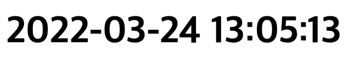
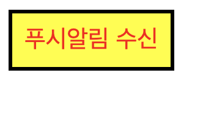
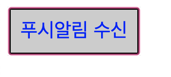
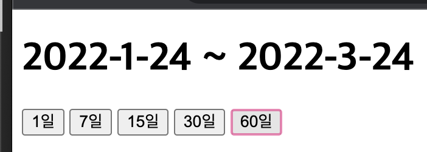

# 유다현 연산자 과제
> 2022-03-23

### 문제 1
```html
<!DOCTYPE html>
<html lang="ko">

<head>
    <meta charset="UTF-8">
    <meta http-equiv="X-UA-Compatible" content="IE=edge">
    <meta name="viewport" content="width=device-width, initial-scale=1.0">
    <title>Document</title>
</head>

<body>
    <h1 id="clock"></h1>
    <script>
        function getTime() {
            let date = new Date();
            let yy = date.getFullYear();
            let mm = date.getMonth() + 1;
            let dd = date.getDate();
            let hh = date.getHours();
            let mi = date.getMinutes();
            let ss = date.getSeconds();
           
           if(yy < 10){
                yy ="0" + yy;
            }

            if(mm < 10){
                mm ="0" + mm;
            }

            if(dd < 10){
                dd ="0" + dd;
            }

            if(hh < 10){
                hh ="0" + hh;
            }

            if(mi < 10){
                mi ="0" + mi;
            }

            if(ss < 10){
                ss ="0" + ss;
            }

            document.querySelector("#clock").innerHTML = yy + "-" + mm + "-" + dd + "\u00A0" + hh + ":" + mi + ":" + ss;
            //console.log(yy+"-"+mm+"-"+dd+ +hh+":"+mi+":"+ss);
        } 
        setInterval(getTime, 1000);     
    </script>
</body>

</html>

```
;

### 문제 2
```html
<!DOCTYPE html>
<html lang="ko">
<head>
    <meta charset="UTF-8">
    <meta http-equiv="X-UA-Compatible" content="IE=edge">
    <meta name="viewport" content="width=device-width, initial-scale=1.0">
    <title>Document</title>
    <style>
        input{
            text-align: center;
            font-size: 20px;
            border: 3px solid #000;
            padding: 10px;   
            color: blue;
            background: #ccc;
        }
        input.on{
            color: red;
            background: yellow;
        }
        
    </style>
</head>
<body>
   <input type="button"  id="btn" value="푸시알림 수신"/>
   <script>
       document.querySelector("#btn").addEventListener("click", e =>{
            e.currentTarget.classList.toggle("on");
       });
   </script>
</body>
</html>
```

;
;
### 문제 3
```html
<!DOCTYPE html>
<html lang="ko">

<head>
    <meta charset="UTF-8">
    <meta http-equiv="X-UA-Compatible" content="IE=edge">
    <meta name="viewport" content="width=device-width, initial-scale=1.0">
    <title>Document</title>
</head>

<body>

    

    <!--  3초마다 한번씩 자동으로 변경 -->

    <script>
        const img = ["cat1.jpeg","cat2.jpeg","cat3.jpeg"];
        let num = 0;

        setInterval(function(){
            num = (num + 1) % img.length;
            document.getElementById("img").setAttribute("src",img[num]);
        },3000);
    </script>
</body>

</html>
```

;

### 문제 **4**
```html
<!DOCTYPE html>
<html lang="ko">
<head>
    <meta charset="UTF-8">
    <meta http-equiv="X-UA-Compatible" content="IE=edge">
    <meta name="viewport" content="width=device-width, initial-scale=1.0">
    <title>Document</title>
</head>
<body>
    <h1>
       <span id="target">2022-2-22 </span> ~ <span id="today"></span>
    </h1>
    <input type="button" value="1일"  id="btn1" class="btn">
    <input type="button" value="7일"  id="btn2" class="btn">
    <input type="button" value="15일" id="btn3" class="btn">
    <input type="button" value="30일" id="btn4" class="btn">
    <input type="button" value="60일" id="btn5" class="btn">
    <script>
       function setTerm(days){
           var today = new Date();
           var start_date = new Date();

           //당일을 포함해야 하므로 주어진 날짜수에서 1을 빼야한다.
           start_date.setDate(start_date.getDate()-(days-1));

           document.getElementById("target").innerHTML = start_date.getFullYear()+'-'+(start_date.getMonth()+1)+'-'+start_date.getDate();
           document.getElementById("today").innerHTML = today.getFullYear()+'-'+(today.getMonth()+1)+'-'+today.getDate();
        }

        setTerm(1);
        document.querySelector("#btn1").addEventListener("click",e => setTerm(1));
        document.querySelector("#btn2").addEventListener("click",e => setTerm(7));
        document.querySelector("#btn3").addEventListener("click",e => setTerm(15));
        document.querySelector("#btn4").addEventListener("click",e => setTerm(30));
        document.querySelector("#btn5").addEventListener("click",e => setTerm(60));

    </script>
</body>
</html>
```

;

