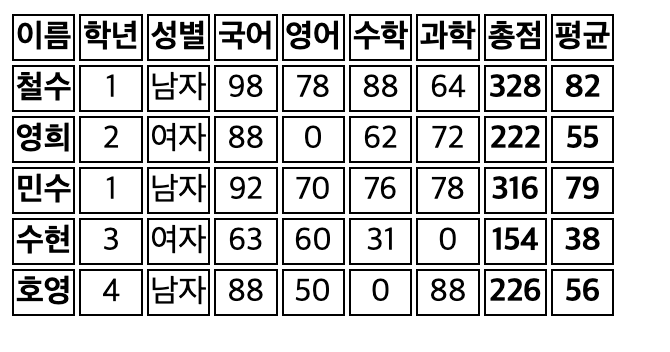

# 유다현 과제
> 2022-04-25
### App.js
---
```javascript
import React from "react";
// import { Route, Routes } from "react-router-dom";
// import {Helmet} from "react-helmet";
import GradeItem from "./GradeItem";

function App() {
  const myStyle = {
    border: "1px solid #000",
  };
  return (
    <table>
      <thead>
        <tr>
          <th style={myStyle}>이름</th>
          <th style={myStyle}>학년</th>
          <th style={myStyle}>성별</th>
          <th style={myStyle}>국어</th>
          <th style={myStyle}>영어</th>
          <th style={myStyle}>수학</th>
          <th style={myStyle}>과학</th>
          <th style={myStyle}>총점</th>
          <th style={myStyle}>평균</th>
        </tr>
      </thead>
      <GradeItem />
    </table>
  );
}

export default App;

```


### GrageData.js
---
```javascript

const GradeData = [
  {
    이름: "철수",
    학년: 1,
    성별: "남자",
    국어: 98,
    영어: 78,
    수학: 88,
    과학: 64,
  },
  {
    이름: "영희",
    학년: 2,
    성별: "여자",
    국어: 88,
    영어: null,
    수학: 62,
    과학: 72,
  },
  {
    이름: "민수",
    학년: 1,
    성별: "남자",
    국어: 92,
    영어: 70,
    수학: 76,
    과학: 78,
  },
  {
    이름: "수현",
    학년: 3,
    성별: "여자",
    국어: 63,
    영어: 60,
    수학: 31,
    과학: null,
  },
  {
    이름: "호영",
    학년: 4,
    성별: "남자",
    국어: 88,
    영어: 50,
    수학: null,
    과학: 88,
  },
];

export default GradeData;

```
### GrageItem.js
---

```javascript

import React from "react";
import GradeData from "./GrageData";


const GradeItem = ({ 이름, 학년, 성별, 국어, 영어, 수학, 과학 }) => {
  const borderBold = {
    border: "1px solid #000",
    textAlign: "center",
    fontWeight:"bold"
  };
  const border = {
    border: "1px solid #000",
    textAlign: "center",
  };

  return (
    <tbody>
      {GradeData.map((student, index) => {
        return (
          <tr>
            <td key={index} style={borderBold}>{student.이름}</td>
            <td key={index} style={border}>{student.학년}</td>
            <td key={index} style={border}>{student.성별}</td>
            <td key={index} style={border}>{student.국어 || 0}</td>
            <td key={index} style={border}>{student.영어 || 0}</td>
            <td key={index} style={border}>{student.수학 || 0}</td>
            <td key={index} style={border}>{student.과학 || 0}</td>
            <td key={index} style={borderBold}>
              { student.국어 + student.영어 + student.수학 + student.과학}
            </td>
            <td key={index} style={borderBold}>
              {parseInt((student.국어 + student.영어 + student.수학 + student.과학) / 4)}
            </td>
          </tr>
        );
      })}
    </tbody>
  );
};


export default GradeItem;


```


