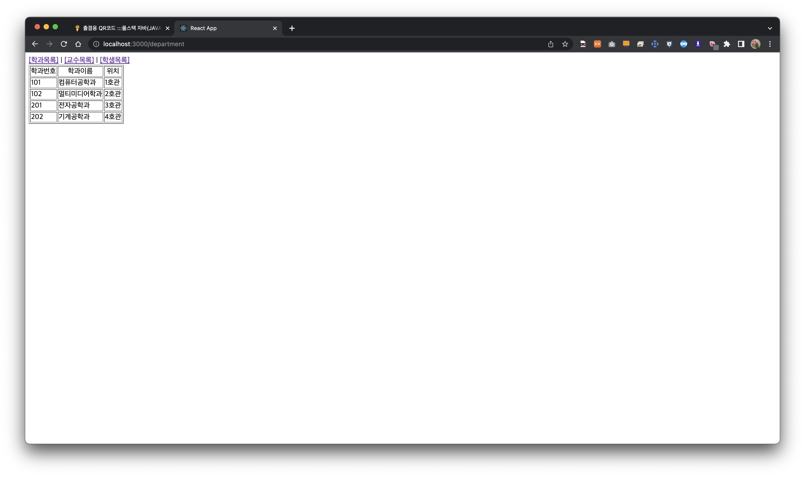
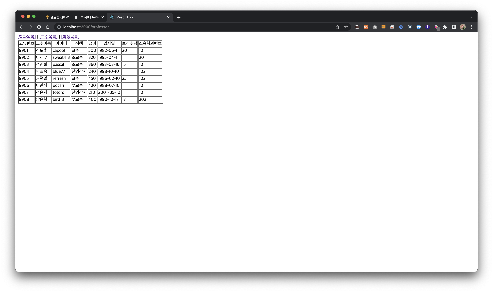
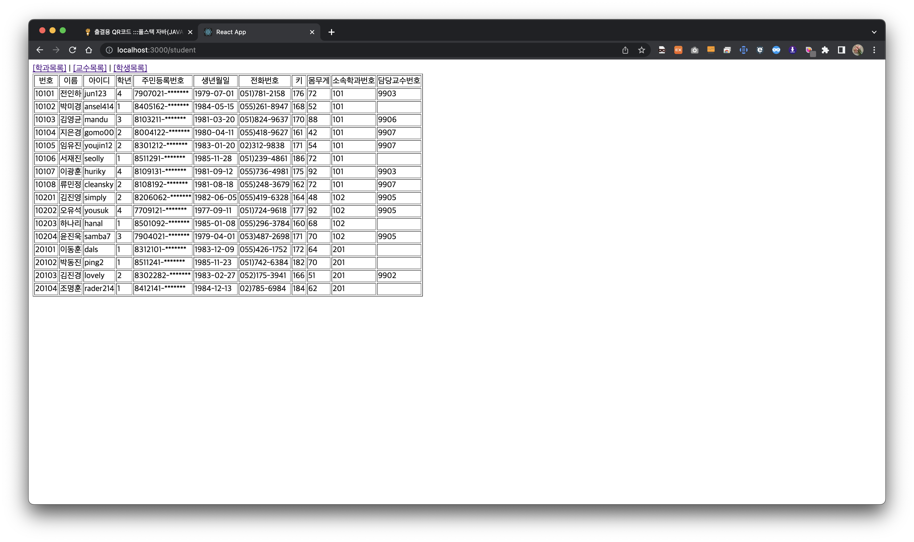

# 유다현 과제
> 2022-04-26


### App.js
---
```javascript

import React from "react";

import { Link, Routes, Route } from "react-router-dom";

import Department from "./pages/Department";
import Student from "./pages/Student";
import Professor from "./pages/Professor";

function App() {
  return (
    <div>
      <nav>
        <Link to="/department">[학과목록]</Link>&nbsp;|&nbsp;
        <Link to="/professor">[교수목록]</Link>&nbsp;|&nbsp;
        <Link to="/student">[학생목록]</Link>
      </nav>
      <Routes>
        <Route path="/department" element={<Department />} />
        <Route path="/professor" element={<Professor/>} />
        <Route path="/student" element={<Student/>} />
      </Routes>
    </div>
  );
}

export default App;

```


### /pages/Department.js
---

```javascript
import React from "react";

import data from "../component/Data";
import DepartmentSub from "../component/DepartmentSub";


const Department = () => {
    const {department} = data;
    // console.log(department);
    
    return (
    <table border="1">
      <thead align="center">
        <td>학과번호</td>
        <td>학과이름</td>
        <td>위치</td>
      </thead>
      <tbody>
        {department.map((v, i) => {
          return <DepartmentSub key={i} id={v.id} dname={v.dname} loc={v.loc} />
        })}
      </tbody>
    </table>
  );
};

export default Department;


```


### /component/DepartmentSub.js
---
```javascript
import React from "react";
import PropTypes from "prop-types";

const ProfessorSub = ({ id, name, userid,position,sal,hiredate,comm, deptno }) => {
  return ( 
        <tr>
           <td>{id}</td>
           <td>{name}</td>
           <td>{userid}</td>
           <td>{position}</td>
           <td>{sal}</td>
           <td>{hiredate.substring(0,10)}</td>
           <td>{comm}</td>
           <td>{deptno}</td> 
           
        </tr>
    );
};


export default ProfessorSub;
```


### /pages/Professor.js
---

```javascript
import React from "react";

import data from "../component/Data";
import ProfessorSub from "../component/ProfessorSub";

const Professor = () => {
  const { professor } = data;
console.log(professor.deptno);
  return (
    <table border="1">
      <thead align="center">
        <td>고유번호</td>
        <td>교수이름</td>
        <td>아이디</td>
        <td>직책</td>
        <td>급여</td>
        <td>입사일</td>
        <td>보직수당</td>
        <td>소속학과번호</td>
      </thead>
      <tbody>
          {professor.map((v,i)=>{
           return    <ProfessorSub key={i}
              id={v.id} name={v.name} userid={v.userid}
              position={v.position} sal={v.sal} hiredate={v.hiredate} comm={v.comm} deptno={v.deptno}/> 
          })}
      </tbody>
    </table>
  );
};

export default Professor;

```


### /component/ProfessorSub.js
---
```javascript

import React from "react";


const ProfessorSub = ({ id, name, userid,position,sal,hiredate,comm, deptno }) => {
  return ( 
        <tr>
           <td>{id}</td>
           <td>{name}</td>
           <td>{userid}</td>
           <td>{position}</td>
           <td>{sal}</td>
           <td>{hiredate.substring(0,10)}</td>
           <td>{comm}</td>
           <td>{deptno}</td> 
           
        </tr>
    );
};


export default ProfessorSub;

```


### /pages/Student.js
---

```javascript
import React from 'react';

import data from "../component/Data";
import StudentSub from "../component/StudentSub";

const Student =()=>{
   
    const {student} = data;
return(
    <table border="1">
        <thead align="center">
            <td>번호</td>
            <td>이름
            </td>
            <td>아이디</td>
            <td>학년</td>
            <td>주민등록번호</td>
            <td>생년월일</td>
            <td> 전화번호</td>
            <td>키</td>
            <td>몸무게</td>
            <td>소속학과번호</td>
            <td>담당교수번호</td>
        </thead>
        <tbody>
            {student.map((v,i)=>{
             return  <StudentSub key ={i}
                     id={v.id} name={v.name}
                     userid={v.userid} grade={v.grade}
                     idnum={v.idnum} birthdate={v.birthdate}
                     tel={v.tel} height={v.height} weight={v.weight}
                     deptno={v.deptno} profno ={v.profno}
                />
            })}
        </tbody>
    </table>
);
};

export default Student;
```


### /component/StidentSub.js
---
```javascript

import React from "react";


const StudentSub = ({ id, name, userid ,grade,idnum,birthdate,tel,height,weight,deptno,profno}) => {
  return ( 
        <tr>
           <td>{id}</td>
           <td>{name}</td>
           <td>{userid}</td>
           <td>{grade}</td> 
           <td>{idnum.substring(0,7)+"-*******"}</td> 
           <td>{birthdate.substring(0,10)}</td>
           <td>{tel}</td>
           <td>{height}</td>
           <td>{weight}</td>
           <td>{deptno}</td>
           <td>{profno}</td>
        </tr>
    );
};


export default StudentSub;

```





