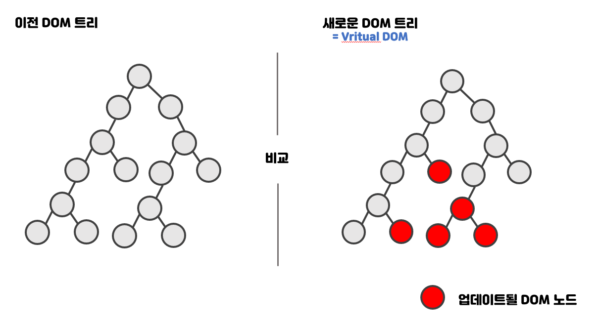

# 유다현 노트정리

### 22.05.03 ~

---

# 01. 리액트 시작
자바스크립트 만으로 규모가 큰 애플리케이션을 만들 수 있게 되었다.
순수 자바스크립트로만 관리가 어렵기 떄문에 수많은 프레임 워크가 이를 해결하려고 노력했다.
MVC 아키텍쳐, MVVM 아키텍쳐 등 여러 구조가 지닌 공통점인 모델과 뷰 중 뷰만 신경쓰는 라이브러리가 탄생했다.

1. Model => data (dom)
2. View => 화면
3. Controller => data를 화면에 출력해주는 처리


## 01) 자바스크립트 기반 프레임 워크

```
Angular,Vue,React
```


## 02) 리액트의 특징



```
자바스크립트를 사용하여 두 가지 뷰를 최소한의 연산으로 비교한 후 ,
둘의 차이를 알아내 최소한의 연산으로 DOM 트리를 업데이트 한다.

방식 자체는 처음부터 다시 랜더링하는 것처럼 보이지만 최적의 자원을 사용하여 이를 수행하는 것.
```


## 03) 작업 환경 설정 - 처음 시작 할 때

```
1. [ Node.js / npm /yarn ] 설치
2.  코드 에디터 설치
3. Git 설치
4. create-react-app으로 프로젝트 만들기
```

---

## 03) 작업 환경 설정 - 새 프로젝트를 시작할 때 ( 패키지까지 같이..)

```
yarn create react-app 프로젝트이름
```

```
cd 프로젝트이름
```

```
yarn add react-router-dom react-helmet-async sass styled-components dayjs
```

---
# 02. JSX

## jsx란 UI를 랜더링하는 것

## 01) JSX 문법

## 컴포넌트 내부는 하나의 DOM 트리구조로 이루어 져야한다.

```javascript
import React, { Fragment } from "react";

function App() {
  return (
    <Fragment>
      <h1>리액트입니당</h1>
    </Fragment>
  );
}

export default App;
```

## 02) 조건부연산자(&&,||,)와 삼항연산자

```javascript
import React from "react";

const If2 = () => {
  const isLogin = true;
  return (
    <div>
      <h2>If2</h2>
      {/* 앤드조건 으로 둘다 거짓인 경우 표시되는 내용 없음 */}
      {isLogin === true && <p>로그인 되셨습니다.</p>}
    </div>
  );
};

export default If2;
```


```javascript
import React from "react";

const If3 = () => {
  const articleList = undefined;

  return (
    <div>
      <h2>If3</h2>
      {/* or 조건식으로 조건이 참인경우 표시되는 내용 없음 */}
      {articleList || <p>조회된 게시글이 없습니다.</p>}
    </div>
  );
};

export default If3;
```


```javascript
import React from "react";

const If4 = () => {
  const isLogin = true;

  return (
    <div>
      <h2>If4</h2>
      {isLogin === true ? (
        <button type="button">로그아웃</button>
      ) : (
        <button type="button">로그인</button>
      )}
    </div>
  );
};

export default If4;
```


## 03) 인라인 스타일링

```javascript
import React from "react";

const App = () => {
  const myStyle = {
    fontSize: "20px",
    backGroundColor: "red",
    border: "1px solid red",
  };
  return <div style={myStyle}>인라인 스타일</div>;
};
export default App;
```


## 04)className 과 slf-closing:

```javascript
import React from "react";
import "./css/style.css";
const App=()=>{
    return(
        <div className="myBox">
            <input type="text"/>
        </div>
        {/*주석 처리는 이렇게 합니다*/}
    )
}

export default App;
```

## 04)vscode 확장팩
1.ESLint
```
https://marketplace.visualstudio.com/items?itemName=dbaeumer.vscode-eslint
```
---
2.prettier
```
https://marketplace.visualstudio.com/items?itemName=esbenp.prettier-vscode
```