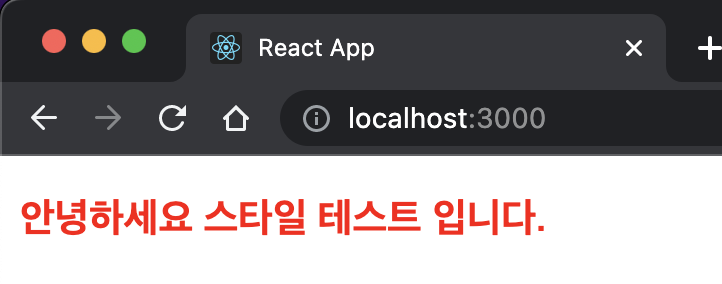
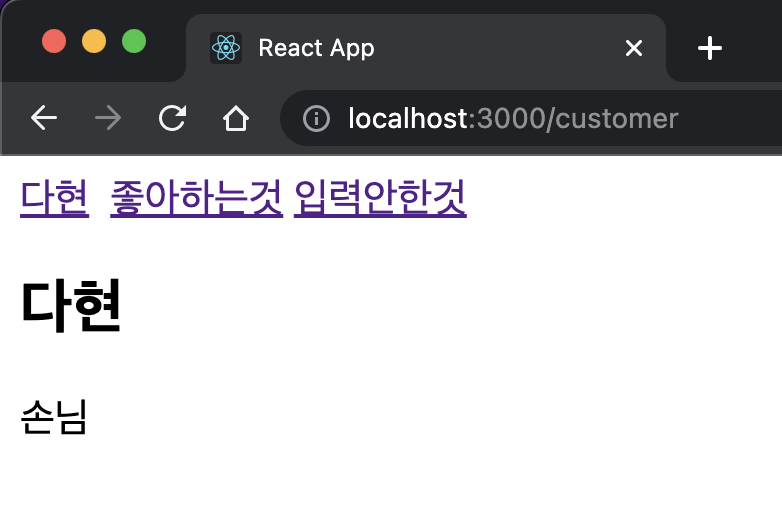
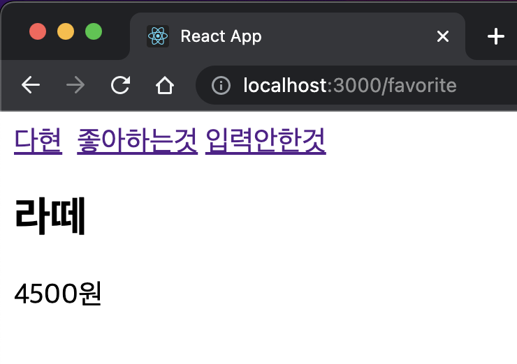
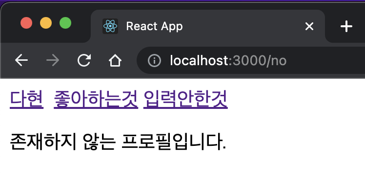

# 유다현 노트정리

### 22.05.10 ~

---

# 01. 컴포넌트 스타일링

1. 일반 css : 컴포넌트를 스타일링 하는 가장 기본 적인 방법
2. sass : 자주 사용되는 css전처리기 중 하나로 확장된 css문법을 사용하여 쉽게 css 코드를 작성할 수 있게 한다.
3. Css Module : 스타일을 작성할 떄 css클래스가 다른 css이름과 절대 충돌하지 않도록 고유한 이름을 생성 해주는 옵션
4. styled-components : 스타일을 파일에 내장 시키는 방식으로 스타일 작성함과 동시에 적용된 컴포넌트를 만들 수 있게 해준다.

### 일반 CSS

```css
.myStyle {
  color: red;
  font-weight: bold;
}
```

```javascript
import React from "react";
import "./css/style.css";

function App() {
  return (
    <div>
      <p className={"myStyle"}>안녕하세요 스타일 테스트 입니다.</p>
    </div>
  );
}

export default App;
```



### 이름 짓는 규칙

```
코딩 컨벤션은 읽고, 관리하기 쉬운 코드를 작성하기 위한 일종의 코딩 스타일 규약이다. 특히 자바스크립트는 다른 언어에 비해 유연한 문법구조(동적 타입, this 바인딩, 네이티브 객체 조작 가능)를 가지기 때문에 개발자 간 통일된 규약이 없다면 코드의 의도를 파악하거나 오류를 찾기 어렵다. 코딩 컨벤션을 준수하면 가독성이 좋아지고, 성능에 영향을 주거나 오류를 발생시키는 잠재적 위험 요소를 줄여준다. 특히 규모가 큰 프로젝트일수록 유지보수 비용을 줄이는 데 도움이 된다.
```

@ 출저 : https://ui.toast.com/fe-guide/ko_CODING-CONVENTION

## Sass 사용하기

yarn으로 패키지를 깔아준다

```
yarn add sass
```

1. sass 확장자는 중괄호와 세미콜론을 사용하지 않는다.
2. 변수 사용이 가능하다
3. 변수이름처럼 사용하기 때문에 카멜표기법으로 작성하는것이 좋다.
4. 믹스인을 사용해 재사용 되는 스타일 불록을 함수처럼 사용 할 수 있다.

## CSS Modules

CSS Modules은 css를 불러와서 사용할 때 클래스 이름을 고유한 값 , 즉 암호화를 형태로 스타일 클래스 이름이 중첩되느 현상을 방지해주는 기술이다.

CSS Module를 사용한 클래스 이름을 두개 이상 적용 할 때는 역따옴표 백틱으로 쓰거나
배열을 문자열로 만드는 함수 join(" ")을 사용해야 한다. (띄어쓰기 필수)

1.첫번째 방법

```js
<div className={`${styled.myStyle} ${styled.myStyle2} `}> </div>
```

2.두번째 방법

```js
<div className={[styled.myStyle, styled.myStyle2].join(" ")}> </div>
```

## styled-components

자바스크립트 파일 안에 스타일을 선언 하는 방식
패키지 설치 방법은

```
yarn add styled-component
```

```javascript
import React from "react";
import styled from "styled-components";

const FooterSt = styled.footer`
  color: #000;
  background-color: #f1f1f1;
  text-align: center;
  padding-top: 32px;
  padding-bottom: 32px;
  a {
    text-decoration: underline;
    color: #000;

    &:hover {
      color: green;
    }
  }
`;
const Footer = () => {
  return (
    <FooterSt>
      Powered by
      <a href="#">w3.css</a>
    </FooterSt>
  );
};

export default Footer;
```

# SPA란?

싱글 페이지 어플리케이션의 약자로 말그대로 한개의 페이지로 이루어진 어플리케이션이라는 의미이다.

사용자가 다른 페이지로 이동할 때 마다 새로운 html을 받아오고, 페이지를 로딩 할 때마다 리소스를 전달 받아 해석한 뒤 화면에 보여주는 방식에서
사용자의 인터렉션이 발생하면 필요한 부부만 자바스크립트를 사용해 업데이트한다 .

다른주소의 다른 화면을 보여주는것을 라우팅이라고 한다.

사용방법

1. 패키지 설치

```
yarn add react-router-dom
```

2. 프로젝트에 라우터 적용

```javascript
import React from "react";
import ReactDOM from "react-dom/client";
import App from "./App";

import { BrowserRouter } from "react-router-dom";
const root = ReactDOM.createRoot(document.getElementById("root"));
root.render(
  <React.StrictMode>
    <BrowserRouter>
      <App />
    </BrowserRouter>
  </React.StrictMode>
);
```

3. 컴포넌트 만들기

```javascript
import React from "react";

const Expr = () => {
  return <div>제가 컴포넌트 입니다.</div>;
};

export default Expr;
```

4. APP 에서 불러오기

```javascript
import React from "react";
import { Routes, Link, Route } from "react-router-dom";

import Expr from "./pages/Expr";

function App() {
  return (
    <div>
      <nav>
        <p>가장 먼저 보여줄 페이지는 exact="true"을 추가한다. </p>
        <Link to="/expr" exact="true">
          [Expr]
        </Link>
      </nav>

      <Routes>
        <Route path="/expr" element={<Expr />} />
      </Routes>
    </div>
  );
}

export default App;
```
라우터 하나에 path 여러개를 설정해줄수 있다.

## useParams
```javascript
import React from "react";
import Expr from './Expr';
import {Routes,Route,Link } from "react-router-dom";

function App() {
  return (
    <div>
      <Link to ="/customer">다현</Link> &nbsp;
      <Link to ="/favorite">좋아하는것</Link>&nbsp;
      <Link to ="/no">입력안한것</Link>&nbsp;
      <Routes>
            <Route path ="/:username" element={<Expr/>}></Route>
      </Routes>
    </div>
   );
} 

export default App;

```

```javascript
import React from 'react';
import { useParams } from 'react-router-dom';
const data={
    customer:{
        name:"다현",
        description :"손님"
    },
    favorite:{
        name:"라떼",
        description:"4500원"
    }
}
const Expr = () => {
    const param =useParams();
    const profile = data[param.username];
    console.log(profile);
     return (
        <div>
            {
                profile ? (
                    <div>
                        <h2>{profile.name}</h2>
                        <p>{profile.description}</p>
                    </div>
                ):(
                    <p>존재하지 않는 프로필입니다.</p>
                )
            }
        </div>
    );
};

export default Expr;
```

useParams를 이용해 현재 값을 조회하여 param 값과 맞는 화면을 출력한다.




# useLocation
```javascript
import React from 'react';
import { useLocation } from 'react-router-dom';
const UseLocation = () => {
    const location =useLocation();
    const {search} = location;
    const query  =new URLSearchParams(search);
    const showDetail = query.get("detail") === "true";

    console.log(showDetail);
    return (
        
        <div>
            <h1>useLocation</h1>
            {showDetail && <p>detail값을 true로 설정하셨군요</p>}            
        </div>
    );
};

export default UseLocation;
```


