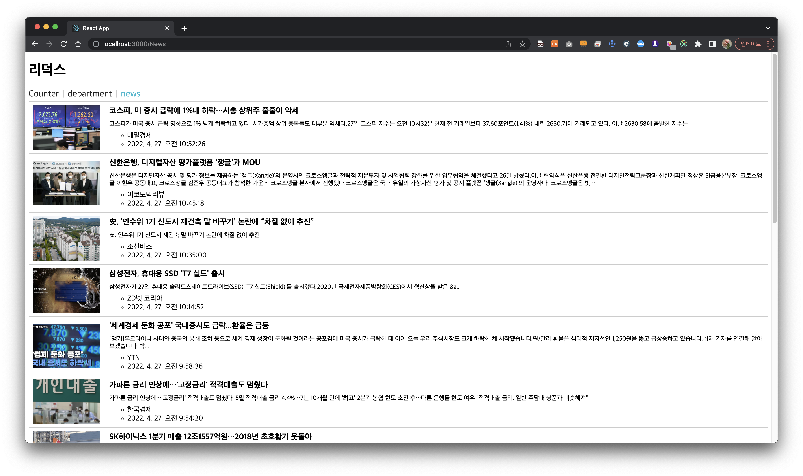

# 유다현 과제

> 2022-05-23

### Index.js

---

```javascript
import React from 'react';
import ReactDOM from 'react-dom/client';

import App from './App';
import {BrowserRouter} from "react-router-dom";

import {Provider} from "react-redux";
import store from "./store";

const root = ReactDOM.createRoot(document.getElementById('root'));
root.render(
  <React.StrictMode>
    <Provider store={store}>
    <BrowserRouter>
    <App />
    </BrowserRouter>
    </Provider>
  </React.StrictMode>
);


```
### App.js

---

```javascript
import React from "react";
import {Route,Routes} from "react-router-dom";

import MenuLink from "./component/MenuLink";
import Counter from "./pages/Counter";
import Department from "./pages/Department";
import News from "./pages/News";

function App() {
  return (
    <div>
      <h1>리덕스</h1>
      <nav>
        <MenuLink to="/counter">Counter</MenuLink>
        <MenuLink to="/department">department</MenuLink>
        <MenuLink to="/News">news</MenuLink>
      </nav>
      <Routes>
         <Route path="/counter" element={<Counter/>} /> 
         <Route path="/department" element={<Department/>} />
         <Route path="/News" element={<News/>} />
      </Routes>

    </div>
  );
}

export default App;

```

### store.js

---

```javascript
import { configureStore  } from '@reduxjs/toolkit';
import {createLogger} from "redux-logger";

import counterSlice from "./slice/CounterSlice";
import departmentSlice from "./slice/DepartmentSlice";
import newsSlice from "./slice/NewsSlice";


const logger = createLogger();

const store = configureStore({
    reducer:{
        counter:counterSlice,
        department:departmentSlice,
        news:newsSlice,
    },
    devTools:true
})

export default store;
```

### NewsSiice.js

---

```javascript

import {createSlice,createAsyncThunk} from "@reduxjs/toolkit";
import axios from "axios";

//비동기 처리 함수 구현//
//payload는 이 함수를 호출 할 때 전달되는 파라미터
export const getList = createAsyncThunk("news/getList",async (payload,{rejectWithValue})=>{
    let result = null;
    try{
        result = await axios.get("http://localhost:3001/news");
    }
    catch(e){
        result = rejectWithValue(e.reponse);
        console.log("에러임");
    }
    return result;
})

const newsSlice = createSlice({

    name: "news",
    initialState:{
        data:null,
        loading:false,
        error:null
    },
    reducer:{},
    extraReducers:{
        [getList.pending]:(state,{payload})=>{
            return {...state,loading:true}
        },
        [getList.fulfilled]:(state,{payload})=>{
            return{
                data:payload?.data,
                loading:false,
                error:null
            }
        },
        [getList.rejected]:(state,{payload})=>{
            return{
                data:payload?.data,
                loading:false,
                error:{
                    code:payload?.status? payload.status : 500,
                    message:payload?.statusText ? payload.extraReducers:"Server Error"
                }
            }
        }
    }
});

export default newsSlice.reducer;
```

### News.js

---

```javascript
import React from 'react';
import Spinner from "../component/Spinner";
import styled from "styled-components";
import NewsItem from "../component/NewsItem";

import {useSelector, useDispatch} from "react-redux";
import {getList} from "../slice/NewsSlice";

const ListContainer = styled.ul`

  list-style: none;
  padding: 0;
  margin: 0;
  width: 100%;
  box-sizing: border-box;
  display: flex;
  flex-direction: column;
  margin-bottom: 30px;
`;

const News = () => {

    const {data,loading,error} = useSelector((state=>state.news));

    const dispatch = useDispatch();
    React.useEffect(()=>{
        dispatch(getList());
    },[dispatch]);

    return (
        <div>
            <Spinner visible={loading}/>
            {error ?(
                <div>
                    <p>{error.code}</p>
                    <p>{error.message}</p>
                </div>
            ):(
                  <ListContainer>
                    {data && data.map((v, i) => <NewsItem key={i} item ={v}/>)}
                 </ListContainer>
            )}
            
        </div>
    );
};

export default News;
```


### NewsItem.js

---
```javascript

import React from 'react';
import styled from "styled-components";

const ListItem = styled.li`
        border-top: 1px solid #ccc;
    
        &:last-child {
            border-bottom:1px solid #ccc
        }
        .list-item-link{

            box-sizing: border-box;
            display: flex;
            
            flex-direction: row;
            align-items: center;
            padding: 5px 10px;
            text-decoration: none;
            color: #000;
            transition: all 0.1s;
            &:hover{
                background-color: #eeeeee;
            }
            .thumbnail{
                width: 150px;
                height: 100px;
                display: block;
                object-fit: cover;
                flex:none;
            }
            .content{
                flex:0 1 auto;
                padding: 5px 0 5px 20px;
                
                h3{
                
                    box-shadow: border-box;
                    font-size: 18px;
                    font-weight: bold;
                    margin: 0;
                    margin-bottom: 10px;
                    display: -webkit-box;
                    overflow: hidden;
                    text-overflow: ellipsis;
                    -webkit-line-clamp:1 ;
                    -webkit-box-orient: vertical;
                }
                p{
                   
                    font-size:14px;
                    margin: 0;
                    margin-bottom: 8px;
                }
            }
        }
    `
const NewsItem = ({item:{author,title,description,url,image,datetime}}) => {
    return (
        <ListItem>
            <a href={url} target="_blank" className="list-item-link" rel="noreferrer">
                
                <div className="content">
                <h3>
                    {title}
                </h3>
                <p>
                    {description}
                </p>
                <ul>
                    <li>{author}</li>
                    <li>
                        {new Date(datetime).toLocaleString()}
                    </li>
                </ul>
                </div>
            </a>

        </ListItem>
            
        
    );
};

export default NewsItem;
```


