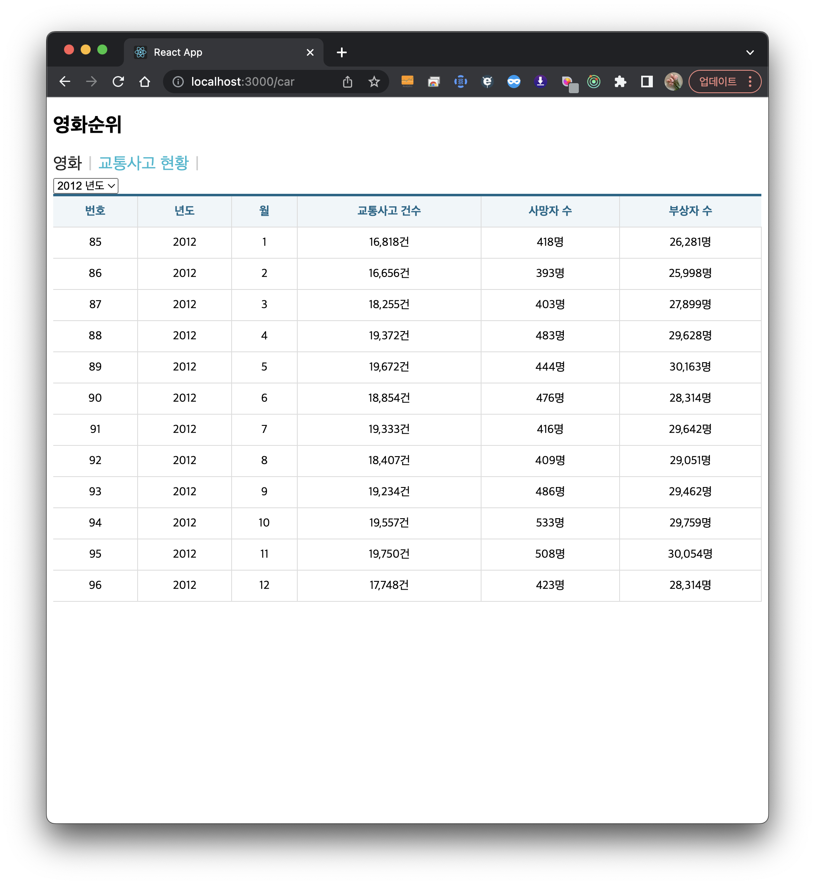
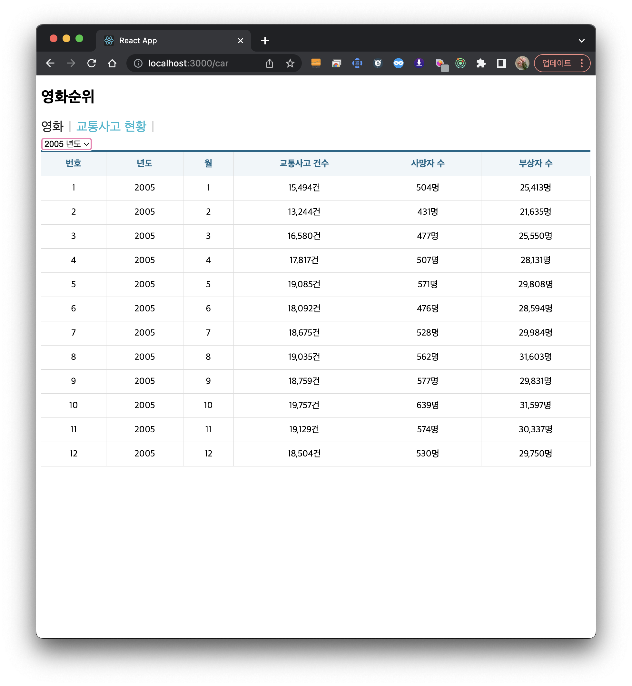

# 유다현 과제

> 2022-05-24

### Index.js

---

```javascript
import React from 'react';
import ReactDOM from 'react-dom/client';

import App from './App';
import {BrowserRouter} from "react-router-dom";

import {Provider} from "react-redux";
import store from "./store";

const root = ReactDOM.createRoot(document.getElementById('root'));
root.render(
  <React.StrictMode>
    <Provider store={store}>
    <BrowserRouter>
    <App />
    </BrowserRouter>
    </Provider>
  </React.StrictMode>
);


```

### App.js

---

```javascript
import React, { memo } from 'react';
import {Routes,Route} from "react-router-dom";
import MovieRank from "./pages/MovieRank";
import MenuLink from "./components/MenuLink"
import Car from "./pages/Car";

const App = memo(() => {
  return (
    <div>
      <h2>영화순위</h2>
      <MenuLink to="/movie">영화</MenuLink>
      <MenuLink to="/car">교통사고 현황</MenuLink>
    <Routes>
      <Route path="/car" element={<Car/>}></Route>
      <Route path="/movie" element={<MovieRank/>}></Route>
    </Routes>

    </div>
  );
});

export default App;
```
### Car.js

---

```javascript

import React, { memo } from 'react';
import {getTraffic} from "../slice/CarSlice";
import Table from "../components/Table";
import Spinner from "../components/Spinner";

import {useSelector,useDispatch} from "react-redux";

const car = memo(() => {
    const {data,loading,error} = useSelector((state)=>state.car);
    
    const [targetDt,settargetDt] = React.useState("");
    const dispatch = useDispatch();
    
    React.useEffect(()=>{
        dispatch(getTraffic(targetDt?{params:{year:targetDt}}: null))
    },[dispatch,targetDt])

    const onSelectChange = React.useCallback((e)=>{
        e.preventDefault();
        settargetDt(parseInt(e.target.value));
        console.log(parseInt(e.target.value))
    },[]);
    return (
        <div>
            <Spinner loading={loading}/>
            <select onChange={onSelectChange}>
                <option>--년도선택</option>
                {[...new Array(2018 - 2005 + 1)].map((v,i) => {
                        return (<option key={i} value={2005 + i}>{2005 + i} 년도
                    </option>);
                })}
            </select>
            {error ? (
                <>
                    <p>에러입니다.</p>
                </>
            ):(
               <Table>
                   <thead>
                       <tr>
                            <th>번호</th>
                            <th>년도</th>
                            <th>월</th>
                            <th>교통사고 건수</th>
                            <th>사망자 수</th>
                            <th>부상자 수</th>
                        </tr>
                   </thead>
                   <tbody>
                       {
                           data&&data.map((v,i)=>{
                               return(
                    
                                   <tr key={i}>
                                       <td>{v.id}</td>
                                       <td>{v.year}</td>
                                       <td>{v.month}</td>
                                       <td>{v.accident.toLocaleString()}건</td>
                                       <td>{v.death.toLocaleString()}명</td>
                                       <td>{v.injury.toLocaleString()}명</td>
                                    
                                   </tr>
                               )
                           })
                       }
                   </tbody>
               </Table>
            )}
        </div>
    );
});

export default car;
```

### CarSlice.js

---

```javascript

import {createSlice,createAsyncThunk} from "@reduxjs/toolkit";
import axios from "axios";

//비동기 처리 함수 구현//
//payload는 이 함수를 호출 할 때 전달되는 파라미터
export const getTraffic = createAsyncThunk("CarSlice/getTraffic",async (payload,{rejectWithValue})=>{
    let result = null;
    try{
        result = await axios.get("http://localhost:3001/traffic_acc",payload);
    }
    catch(e){
        result = rejectWithValue(e.reponse);
    }
    return result;
})

const  CarSlice= createSlice({

    name: "car",
    initialState:{
        data:null,
        loading:false,
        error:null
    },
    reducers:{},
    extraReducers:{
        [getTraffic.pending]:(state,{payload})=>{
            return {...state,loading:true}
        },
        [getTraffic.fulfilled]:(state,{payload})=>{
            return{
                data:payload?.data,
                loading:false,
                error:null
            }
        },
        [getTraffic.rejected]:(state,{payload})=>{
            return{
                data:payload?.data,
                loading:false,
                error:{
                    code:payload?.status? payload.status : 500,
                    message:payload?.statusText ? payload.extraReducers:"Server Error"
                }
            }
        }
    }
});

export default CarSlice.reducer;
```


