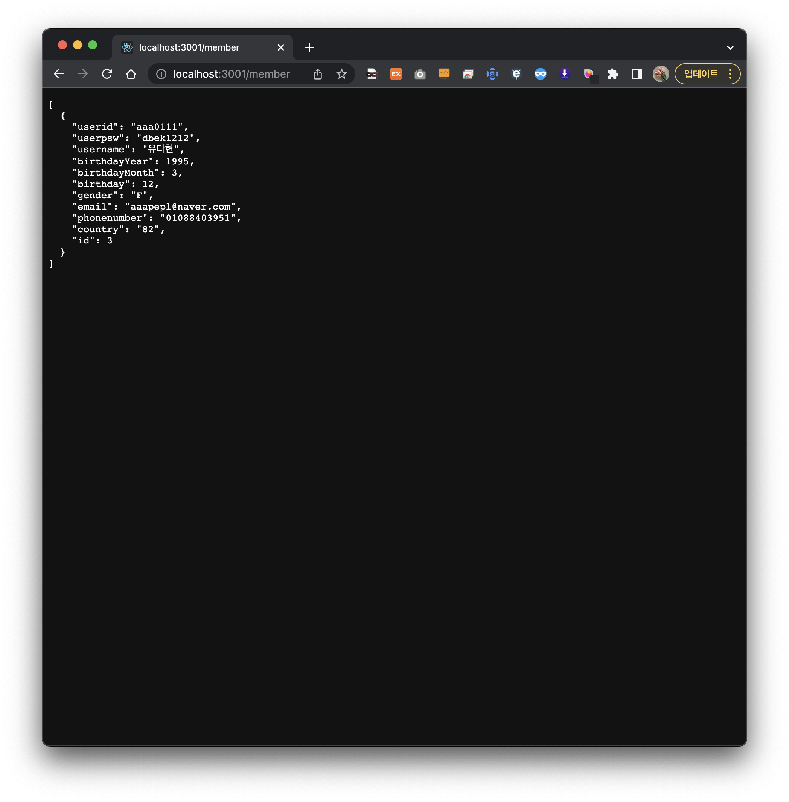
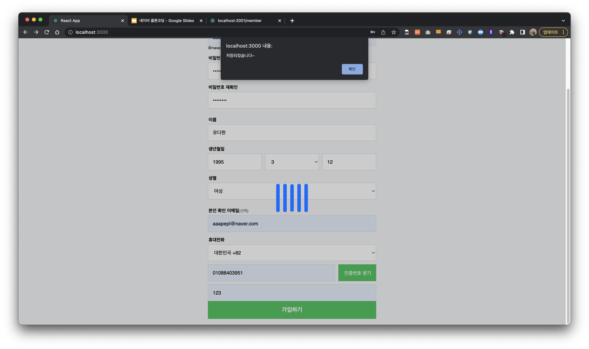

# 유다현 과제

> 2022-05-19

# regexHelper , Spinner 이하 파일 동일하기 때문에 참고 하지 않았습니다.
### App.js

---
```javascript
import React from "react";
import "./assets/css/style.css";
import useAxios from "axios-hooks";
import regexHelper from "./libs/RegexHelper";

import Spinner from "./component/Spinner";

const  App=()=> {

/*데이터 저장을 위한 Ajax 요청 객체 생성 - 메뉴얼 전송 모드*/
  const [{loading},refetch] = useAxios({
      url:"http://localhost:3001/member",
      method:"POST"
  },{manual:true});

  const onSubmit = (e)=>{
      e.preventDefault();

      const current = e.target;
      try{
            regexHelper.value(current.userid,"아이디를 입력하세요");
            regexHelper.minLength(current.userid,2,"아이디는 두글자 이상 입력하세요");
            regexHelper.maxLength(current.userid,20,"아이디는 20글자 이하 입력하세요");
            
            regexHelper.value(current.userpsw,"비밀번호를 입력하세요");
            regexHelper.minLength(current.userpsw,2,"비밀번호는 두글자 이상 입력하세요");
            regexHelper.maxLength(current.userpsw,20,"비밀번호는 20글자 이하 입력하세요");

            regexHelper.value(current.userpswre,"비밀번호확인 칸을 입력하세요");
            regexHelper.compareTo(current.userpsw,current.userpswre,"비밀번호 재확인 칸을 확인하세요");

            regexHelper.value(current.username,"이름을 입력하세요");
            regexHelper.minLength(current.username,2,"이름은 두글자 이상 입력하세요");
            regexHelper.maxLength(current.username,40,"이름은 40글자 이하 입력하세요");

            regexHelper.value(current.useryear,"생년을 입력하세요");
            regexHelper.num(current.useryear,"생년은 숫자로 입력하세요");
            regexHelper.maxLength(current.useryear,4,"생년은 4글자 이하 입력하세요");

            regexHelper.value(current.usermonth,"생월을 선택하세요.");

            regexHelper.value(current.userday,"생일을 입력하세요");
            regexHelper.num(current.userday,"생일은 숫자로 입력하세요");
            regexHelper.maxLength(current.userday,2,"생일은 2글자 이하 입력하세요");

            regexHelper.email(current.useremail,"이메일 형식을 확인하세요");

            regexHelper.phoneNum(current.usernum,"핸드폰 번호를 확인하세요");

            regexHelper.value(current.usercountry,"지역을 선택하세요");
            
            regexHelper.num(current.autonum,"인증번호는 숫자로 입력하세요.");
            
      }catch(e){
          console.error(e);
          window.alert(e.message);
          e.field.focus();
          return;
      }
      let json = null;
      //입력,수정,삭제 처리는 async ~await 문법을 사용한다.
      (async ()=>{
        try{
            const response = await refetch({
                data:{
                    userid : current.userid.value,
                    userpsw : current.userpsw.value,
                    username : current.username.value,
                    birthdayYear : parseInt(current.useryear.value),
                    birthdayMonth: parseInt(current.usermonth.value),
                    birthday:parseInt(current.userday.value),
                    gender : current.usergender.value,
                    email: current.useremail.value,
                    phonenumber:current.usernum.value,
                    country:current.usercountry.value
                }
            });
            json = response.data;
        }
        catch(e){
            console.error(e);
            window.alert(`
            ${e.message}`)
        }   

        //정상으로 저장되었다면?
        if(json !== null){
            window.alert("저장되었습니다~")
        }
      })();
  };
  
  return (
      <>    
      <Spinner visible={loading}/>
        <div className="con">
            <h1>
                <span>
                    NAVER
                </span>
                
            </h1>
                <form onSubmit={onSubmit}>
                <div className="row">
                    <label className="title" htmlFor="userid">아이디</label>
                    <span className="name-email">
                        <input type="text"  className="field"  name="userid" /><span>@naver.com</span>
                    </span>              
                    <label className="title field"  htmlFor="userpsw">비밀번호</label>
                    <input type="password" name="userpsw"  />
                    <label className="title" htmlFor="userpswre">비밀번호 재확인</label>
                    <input type="password" className="field" name="userpswre"  /> 
                </div>
                <div className="row">
                    <label className="title" htmlFor="username">이름</label>
                    <input type="text" className="field" name="username"/>
                    <label className="title" htmlFor="useryear">생년월일</label>
                    <div className="b-day-field">
                        <input type="text" className="field" placeholder="년(4자)" name="useryear"/>
                        <select name="usermonth">
                            <option value="0"  > 월</option>
                            <option value="1"  > 1</option>
                            <option value="2"  > 2</option>
                            <option value="3"  > 3</option>
                            <option value="4"  > 4</option>
                            <option value="5"  > 5</option>
                            <option value="6"  > 6</option>
                            <option value="7"  > 7</option>
                            <option value="8"  > 8</option>
                            <option value="9"  > 9</option>
                            <option value="10" >10</option>
                            <option value="11" >11</option>
                            <option value="12" >12</option>
                        </select>
                        <input type="text" className="field" placeholder="일" name="userday"/>
                    </div>
                    <label className="title" htmlFor="usergender">성별</label>
                    <select name="usergender">
                        <option value="">성별</option>
                        <option value="M">남성</option>
                        <option value="F">여성</option>
                        <option value="U">선택안함</option>
                    </select>
                </div>
                <div className="row">
                    <label className="title" htmlFor="usermail">본인 확인 이메일<span>(선택)</span></label>
                    <input type="text" className="field" placeholder="선택입력" name="useremail"/>
                    <label className="title" htmlFor="user_num">휴대전화</label>
                    <select name="usercountry">
                        <option value="82" >대한민국 +82</option>
                        <option value="81" >일본 +81</option>
                        <option value="86" >중국 +86</option>
                    </select>
                    <div className="num-field">
                        <input type="text" name="usernum" className="field" placeholder="전화번호 입력"/>
                        <input type="submit" name="autoNumBtn"  className="btn-style field" value="인증번호 받기"/>
                    </div>
                    <input type="text" name="autonum" className="field" placeholder="인증번호 입력하세요"/>
                </div>

                <button type="submit"  className="btn-style" name="btn1">
                    가입하기
                </button>
            </form>
        </div>
      </>
  );
};

export default React.memo(App);


```



